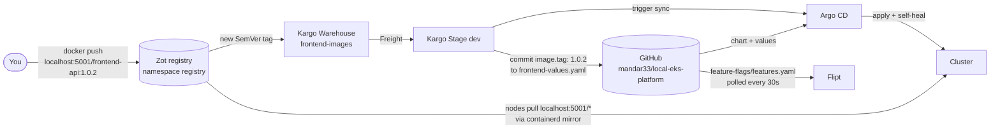

# local-eks-platform

A production-shaped Kubernetes platform that runs on a laptop. Two Python APIs sit behind an Istio ingress gateway. A feature flag in Flipt decides which database schema the frontend reads. Images live in a private Zot registry, Kargo promotes new versions, and Argo CD deploys everything from this Git repo.

It's meant for learning how the usual EKS building blocks fit together (service mesh, GitOps, feature flags, autoscaling, image promotion and secrets management) without a cloud account.

**No secrets are stored in this repo.** Database users, the registry login and Kargo's GitHub token all live in HashiCorp Vault (see [Secrets](#secrets)).

## Architecture

### Request flow

A call to `http://localhost:8080/users/1` takes this path:


1. kind forwards `localhost:8080` to NodePort 30080 on the control-plane node, where the Istio ingress gateway listens.
2. The gateway's `VirtualService` sends every path to `frontend-api-svc`.
3. The frontend asks Flipt whether `enable-new-schema` is on for this user.
4. It calls `crud-api` at `/api/v2/...` if the flag is on, or `/api/v1/...` if it's off. The two sidecars encrypt this call with mutual TLS. An `AuthorizationPolicy` only lets the frontend's ServiceAccount through.
5. `crud-api` reads `users_v1` or `users_v2` from Postgres, logging in as a short-lived, read-only user that Vault created for it (dotted lines).

### Delivery flow

How a new version gets from your laptop into the cluster:



1. You build an image and push it to Zot with a new version tag.
2. Kargo's Warehouse notices the tag and records it as **Freight**.
3. You promote the Freight to the `dev` Stage (UI, CLI or a `Promotion` resource).
4. The Stage clones this repo, sets `image.tag` in `frontend-values.yaml`, commits as "Kargo", pushes, and asks Argo CD to sync.
5. Argo CD rolls out the Deployment, and the kind nodes pull the image from Zot.

Git stays the record of what runs where: every promotion is a commit you can read, revert or audit.

## Components

| Component | Version | Namespace | What it does here |
|---|---|---|---|
| [kind](https://kind.sigs.k8s.io/) | v0.33.0 (Kubernetes v1.34.11) | – | Runs the cluster as Docker containers: 1 control-plane, 2 workers. |
| [Istio](https://istio.io/) | 1.31.1 | `istio-system` | Ingress gateway, sidecar proxies, mesh-wide STRICT mTLS and authorization policies. |
| [Argo CD](https://argo-cd.readthedocs.io/) | v3.5.3 | `argocd` | Keeps the cluster in sync with this repo, with automatic sync, prune and self-heal. |
| [Flipt](https://www.flipt.io/) | v1.61.1 | `default` | Evaluates feature flags. Reads `feature-flags/` from GitHub (read-only, git storage). |
| Postgres | 17 | `data` | Holds the `users_v1` and `users_v2` tables, seeded on first start. |
| [Vault](https://developer.hashicorp.com/vault) | 2.0.4 (chart 0.34.1) | `vault` | Issues short-lived Postgres users; stores the registry login and Kargo's GitHub token. |
| [Vault Secrets Operator](https://developer.hashicorp.com/vault/docs/platform/k8s/vso) | 1.6.0 | `vault-secrets-operator-system` | Copies secrets from Vault into Kubernetes Secrets, and restarts apps when they change. |
| [Zot](https://zotregistry.dev/) | v2.1.21 | `registry` | Private OCI registry for the app images: TLS, anonymous pull, authenticated push, web UI, vulnerability scanning. |
| [Kargo](https://kargo.io/) | 1.11.4 | `kargo` | Watches Zot for new `frontend-api` tags and promotes them into `dev` through Git. |
| [cert-manager](https://cert-manager.io/) | v1.21.2 | `cert-manager` | Issues Zot's TLS certificate (from a cluster-local CA) and Kargo's webhook certificates. |
| [metrics-server](https://github.com/kubernetes-sigs/metrics-server) | latest chart | `kube-system` | Supplies CPU metrics to the HPAs. |
| [Argo Rollouts](https://argoproj.github.io/rollouts/) | v1.10.0 | `argo-rollouts` | Progressive delivery (canary, blue/green). Installed for Kargo verification, not used yet. |

### The apps

| App | What it does | Endpoints |
|---|---|---|
| `frontend-api` | The public API. Asks Flipt which schema to use, then calls `crud-api`. | `GET /users/{id}`, `GET /healthz` |
| `crud-api` | Reads users from Postgres. Only reachable from `frontend-api`. | `GET /api/v1/users/{id}`, `GET /api/v2/users/{id}`, `GET /healthz` |

Both are FastAPI apps listening on port 8000, deployed from `localhost:5001/<app>:<version>`. Configuration comes from environment variables set in the Helm values files. `crud-api` reads `DB_USER` and `DB_PASSWORD` from the `crud-db` Secret, which the Vault Secrets Operator creates and keeps up to date.

## Repository layout

```
local-eks-platform/
├── apps/
│   ├── frontend-api/            # FastAPI app, Dockerfile, requirements.txt
│   └── crud-api/                # FastAPI app, Dockerfile, requirements.txt
├── feature-flags/
│   └── features.yaml            # Flipt flags, read from GitHub by Flipt
├── k8s-manifests/
│   ├── charts/base-api/         # One Helm chart for both APIs:
│   │                            #   Deployment, Service, HPA, ServiceAccount
│   └── environments/dev/
│       ├── frontend-values.yaml # frontend values (image, env); Kargo updates image.tag
│       ├── crud-values.yaml     # crud values (image, env, which Secret keys to read)
│       ├── argocd-apps.yaml     # The seven Argo CD Applications
│       ├── networking/          # Istio Gateway, VirtualService, AuthorizationPolicy
│       ├── data/                # Postgres StatefulSet + seed SQL (no credentials)
│       ├── secrets/             # Vault Secrets Operator resources for crud-db
│       ├── registry/            # Zot: TLS certs, config, Deployment, NodePort 30500
│       └── kargo/               # Kargo Project, Warehouse, Stage, Git credentials
├── platform/vault/              # Helm values for Vault
├── scripts/
│   ├── bootstrap-vault.sh       # Install + configure Vault; `unseal` after restarts
│   ├── setup-registry.sh        # Registry login in Vault, node mirrors, docker login
│   ├── set-kargo-git-token.sh   # Store Kargo's GitHub token in Vault (hidden prompt)
│   └── lib.sh                   # Shared helpers
├── kind-config.yaml             # Cluster layout; ports 8080, 8443, 5001; registry mirrors
├── istio-config.yaml            # Istio install overlay (gateway as NodePort 30080/30443)
└── istio-mtls.yaml              # Mesh-wide STRICT mTLS
```

Argo CD Applications in `argocd-apps.yaml`:

| Application | Source | Deploys |
|---|---|---|
| `frontend-api-dev` | `charts/base-api` + `frontend-values.yaml` | frontend Deployment, Service, HPA, ServiceAccount |
| `crud-api-dev` | `charts/base-api` + `crud-values.yaml` | crud Deployment, Service, HPA, ServiceAccount |
| `platform-networking-dev` | `environments/dev/networking/` | Gateway, VirtualService, AuthorizationPolicy |
| `postgres-dev` | `environments/dev/data/` | Postgres StatefulSet, Service, seed SQL |
| `vault-secrets-dev` | `environments/dev/secrets/` | Resources that produce the `crud-db` Secret |
| `registry-dev` | `environments/dev/registry/` | Zot and its certificates and login |
| `kargo-dev` | `environments/dev/kargo/` | Kargo Project, Warehouse, Stage and Git credentials |

## Setup from scratch

**Prerequisites:** Docker, `kind`, `kubectl`, `helm`, `istioctl` 1.31.x and Bash. On Windows, use Git Bash (see [Windows notes](#windows-notes)).

> **Docker on cgroup v1** (for example Docker Desktop on an older WSL2 kernel) can't run Kubernetes 1.35 or later. That's why `kind-config.yaml` pins v1.34.11.

```bash
# 1. Cluster (also maps localhost:5001 to the registry and enables registry mirrors)
kind create cluster --name dev-cluster --config=kind-config.yaml

# 2. Istio + sidecar injection + STRICT mTLS
istioctl install -f istio-config.yaml -y
kubectl label namespace default istio-injection=enabled
kubectl apply -f istio-mtls.yaml

# 3. Argo CD (server-side apply: one CRD is too large for client-side apply)
kubectl create namespace argocd
kubectl apply -n argocd --server-side --force-conflicts \
  -f https://raw.githubusercontent.com/argoproj/argo-cd/v3.5.3/manifests/install.yaml

# 4. cert-manager (Zot's TLS) and metrics-server (HPAs; kind needs --kubelet-insecure-tls)
helm upgrade --install cert-manager oci://quay.io/jetstack/charts/cert-manager \
  --version v1.21.2 -n cert-manager --create-namespace --set crds.enabled=true --wait
helm repo add metrics-server https://kubernetes-sigs.github.io/metrics-server/
helm upgrade --install metrics-server metrics-server/metrics-server -n kube-system \
  --set 'args={--kubelet-insecure-tls}'

# 5. Flipt, reading flags from this repo
helm repo add flipt https://helm.flipt.io
helm upgrade --install flipt flipt/flipt -n default \
  --set flipt.config.storage.type=git \
  --set flipt.config.storage.git.repository=https://github.com/mandar33/local-eks-platform.git \
  --set flipt.config.storage.git.ref=main \
  --set flipt.config.storage.git.directory=feature-flags

# 6. Argo Rollouts and Kargo. Type the Kargo admin password at the hidden prompt.
kubectl create namespace argo-rollouts
kubectl apply -n argo-rollouts --server-side --force-conflicts \
  -f https://github.com/argoproj/argo-rollouts/releases/download/v1.10.0/install.yaml
read -rsp "Kargo admin password: " PASS; echo
HASH=$(printf '%s\n' "$PASS" | docker run --rm -i httpd:2.4-alpine htpasswd -niBC 10 "" | tr -d ':\r\n'); unset PASS
helm upgrade --install kargo oci://ghcr.io/akuity/kargo-charts/kargo --version 1.11.4 \
  -n kargo --create-namespace \
  --set api.adminAccount.passwordHash="$HASH" \
  --set api.adminAccount.tokenSigningKey="$(openssl rand -base64 48)" --wait
unset HASH

# 7. Hand the rest to Argo CD. Some apps wait for steps 8-10; that's expected.
kubectl apply -n argocd -f k8s-manifests/environments/dev/argocd-apps.yaml

# 8. Vault: installs Vault + the operator, creates the Postgres admin password,
#    connects Vault to Postgres and rotates that password.
scripts/bootstrap-vault.sh

# 9. Registry: push login in Vault, containerd mirrors on the nodes, docker login
scripts/setup-registry.sh

# 10. Build and push the app images
for app in frontend-api crud-api; do
  docker build -t localhost:5001/$app:1.0.0 apps/$app
  docker push localhost:5001/$app:1.0.0
done

# 11. Kargo's GitHub token (fine-grained: this repo only, Contents read/write)
scripts/set-kargo-git-token.sh

kubectl get applications -n argocd -w     # wait for all seven: Synced / Healthy
```

What waits for what, so nothing surprises you:

- `postgres-0` waits for the `postgres-admin` Secret (step 8).
- `crud-api` waits for `crud-db` (step 8) and both apps wait for their images (step 10), showing `ImagePullBackOff` until then.
- `registry-dev` and `kargo-dev` retry until the Vault Secrets Operator exists (step 8).
- Kargo can't push commits until step 11.

**After Docker or the laptop restarts:** Vault starts sealed. Run `scripts/bootstrap-vault.sh unseal`.

### Windows notes

- **Use Git Bash, not PowerShell.** The commands and scripts are Bash. In PowerShell, `KUBECTL="..." script.sh` fails with "not recognized as the name of a cmdlet". To start a script from PowerShell anyway:
  ```powershell
  & "C:\Program Files\Git\bin\bash.exe" -lc 'cd ~/Downloads/local-eks-platform && scripts/set-kargo-git-token.sh'
  ```
  Don't put double quotes inside the single-quoted part: Windows PowerShell 5.1 strips them. Set variables first with `$env:NAME = '...'`.
- **Antivirus HTTPS scanning** (for example Norton Web Shield) breaks kubectl, helm and git with `x509: certificate signed by unknown authority`. Exclude those programs from HTTPS scanning. Until then, all scripts accept a `KUBECTL` override that runs kubectl inside the control-plane container:
  ```bash
  export KUBECTL="docker exec -i dev-cluster-control-plane kubectl --kubeconfig /etc/kubernetes/admin.conf"
  scripts/bootstrap-vault.sh unseal
  ```
  For git: `git config --global http.sslBackend schannel`.
- **Port 8081** is often taken (JFrog Artifactory uses it), so the Argo CD UI below uses 8090.

## How to test each component

For tests from inside the mesh, start a throwaway pod once. It gets a sidecar like any app in `default`:

```bash
kubectl run curl -n default --image=curlimages/curl --restart=Never --command -- sleep 86400
kubectl wait pod/curl --for=condition=Ready --timeout=120s
```

### End to end

```bash
curl localhost:8080/users/1
# {"id":1,"experimental_data":{"name":"Alice","tier":"gold","schema":"v2"}}
```

`experimental_data` means the flag is on and the request reached the v2 endpoint.

### Helm (one chart, two apps)

Both APIs come from `charts/base-api`. Only the values files differ. Helm runs locally; no cluster needed.

```bash
helm lint k8s-manifests/charts/base-api -f k8s-manifests/environments/dev/frontend-values.yaml
# 1 chart(s) linted, 0 chart(s) failed

# What Argo CD will apply for the frontend
helm template frontend-api k8s-manifests/charts/base-api \
  -f k8s-manifests/environments/dev/frontend-values.yaml | grep -E "^kind:|^  name:"
# kind: ServiceAccount / Service / Deployment / HorizontalPodAutoscaler

# Same chart, different values: compare images and env vars
for v in frontend crud; do echo "[$v]"
  helm template x k8s-manifests/charts/base-api -f k8s-manifests/environments/dev/$v-values.yaml \
    | grep -E "image:|- name: [A-Z_]+$"; done
# [frontend] CRUD_API_URL, FLIPT_URL      [crud] DB_HOST, DB_NAME, DB_PORT, DB_PASSWORD, DB_USER

# See exactly what one extra value changes
diff <(helm template x k8s-manifests/charts/base-api -f k8s-manifests/environments/dev/frontend-values.yaml) \
     <(helm template x k8s-manifests/charts/base-api -f k8s-manifests/environments/dev/frontend-values.yaml --set env.LOG_LEVEL=debug)
# >         - name: LOG_LEVEL
# >           value: "debug"
```

To make a change permanent, put it in the values file and push. Argo CD renders the chart the same way.

### Ingress gateway

```bash
curl -s -o /dev/null -D - localhost:8080/users/1 | grep -iE "server|x-envoy"
# server: istio-envoy
# x-envoy-upstream-service-time: 33

curl -s -o /dev/null -w "%{http_code}\n" localhost:8080/api/v1/users/1
# 404   (crud-api is not exposed; only the frontend is routed)
```

Routing, rewrites, timeouts, retries and fault injection all go in the `VirtualService` in `k8s-manifests/environments/dev/networking/istio-networking.yaml`.

### Service-to-service (mTLS + authorization)

```bash
# The curl pod runs as sa/default, which the AuthorizationPolicy doesn't allow
kubectl exec curl -c curl -- curl -s -w " [%{http_code}]\n" http://crud-api-svc/api/v1/users/1
# RBAC: access denied [403]

# Plaintext (sent from the sidecar container itself) is rejected by STRICT mTLS
kubectl exec curl -c istio-proxy -- curl -s http://crud-api-svc/api/v1/users/1; echo "exit $?"
# exit 56   (connection reset)

# Services without a policy accept any mesh caller
kubectl exec curl -c curl -- curl -s http://frontend-api-svc/healthz
# {"status":"ok"}
```

### Feature flags (Flipt)

```bash
kubectl exec curl -c curl -- curl -s -X POST \
  http://flipt.default.svc.cluster.local:8080/evaluate/v1/boolean \
  -H 'Content-Type: application/json' \
  -d '{"namespaceKey":"default","flagKey":"enable-new-schema","entityId":"1","context":{}}'
# {"enabled":true, "reason":"DEFAULT_EVALUATION_REASON", ...}
```

To change a flag, edit `feature-flags/features.yaml`, commit and push. Flipt picks it up within about 30 seconds. For example, set `enabled: false` and `curl localhost:8080/users/1` returns `{"id":1,"standard_data":"Alice (v1 schema)"}`. Percentage rollouts and segments go under `rollouts:` on the flag. See the [Flipt docs](https://docs.flipt.io/).

If Flipt crash-loops after a push, the file has a field Flipt doesn't accept. `kubectl logs deploy/flipt -c flipt` names the line.

### Argo CD

```bash
kubectl get applications -n argocd                 # all seven: Synced / Healthy

# Self-heal: delete something Argo CD manages and watch it come back
kubectl delete svc crud-api-svc && kubectl get svc crud-api-svc
# crud-api-svc   ClusterIP   ...   1s

# UI at https://localhost:8090 (user: admin)
kubectl port-forward svc/argocd-server -n argocd 8090:443
kubectl -n argocd get secret argocd-initial-admin-secret -o jsonpath="{.data.password}" | base64 -d; echo
```

**Rolling back** is a Git revert: `git revert <commit> && git push`, and Argo CD applies the previous state.

### Autoscaling (HPA)

The Deployments don't set `replicas`, so the HPA owns the replica count and Argo CD doesn't reset it. Generate load from inside the mesh and watch it scale:

```bash
kubectl run load --image=busybox:1.37 --restart=Never --command -- sh -c \
  'for i in 1 2 3 4 5 6 7 8; do (while true; do wget -q -O- http://frontend-api-svc/users/1 >/dev/null 2>&1; done) & done; wait'

kubectl get hpa frontend-api-hpa -w
# cpu: 2%/70%     1   3   1
# cpu: 197%/70%   1   3   1
# cpu: 549%/70%   1   3   3     <- scaled to the max within about 40 seconds

kubectl delete pod load
```

After the load stops, replicas drop back to 1 once the HPA's 5-minute scale-down window passes. `crud-api-hpa` rises too, because every frontend request calls crud.

### Vault database credentials

```bash
# The operator's view: has it fetched credentials?
kubectl get vaultdynamicsecret crud-db
# NAME      SYNCED   HEALTHY   READY
# crud-db   True     True      True

# The username Vault generated for crud-api (don't print the password)
kubectl get secret crud-db -o jsonpath='{.data.username}' | base64 -d; echo
# v-kubernet-crud-api-y43L26afNrQM0wCIXvdG-1790373574

# Restart Vault: it comes back sealed, the app keeps serving, then unseal it
kubectl delete pod vault-0 -n vault
kubectl exec -n vault vault-0 -- vault status | grep Sealed     # Sealed  true
curl -s -o /dev/null -w "%{http_code}\n" localhost:8080/users/1  # 200
scripts/bootstrap-vault.sh unseal                               # Vault unsealed.
```

What was verified on this cluster:

- The issued user can `SELECT` from `users_v1` and `users_v2`, but gets `must be owner of table` when trying `DROP` or `DELETE`.
- The bootstrap admin password in `postgres-admin` is rejected (`password authentication failed`) after Vault rotates it. Only Vault knows the current one.
- Credentials last 1 hour and are renewed up to 24 hours. After that, Vault issues a new user, the operator updates `crud-db` and restarts `crud-api`.

Vault UI: `kubectl port-forward -n vault svc/vault 8200:8200`, then open `http://localhost:8200` and sign in with the root token from `~/.local-eks-platform/vault-init.json`.

### Registry (Zot)

```bash
# Anyone can read
curl -sk https://localhost:5001/v2/_catalog
# {"repositories":["crud-api","frontend-api"]}
curl -sk https://localhost:5001/v2/frontend-api/tags/list
# {"name":"frontend-api","tags":["1.0.0","1.0.1"]}

# Nobody can push without the login
curl -sk -o /dev/null -w "%{http_code}\n" -X POST https://localhost:5001/v2/frontend-api/blobs/uploads/
# 401

# Log Docker in (password comes from Vault on stdin), then push
scripts/setup-registry.sh login
docker tag localhost:5001/frontend-api:1.0.1 localhost:5001/frontend-api:1.0.2
docker push localhost:5001/frontend-api:1.0.2

# Known vulnerabilities in an image (Zot scans with Trivy)
curl -sk -X POST https://localhost:5001/v2/_zot/ext/search -H 'Content-Type: application/json' \
  -d '{"query":"{ CVEListForImage(image: \"frontend-api:1.0.0\") { Summary { Count CriticalCount HighCount MediumCount LowCount } } }"}'
# {"data":{"CVEListForImage":{"Summary":{"Count":71,"CriticalCount":0,"HighCount":10,...}}}}
```

The web UI is at `https://localhost:5001`. The browser warns about the certificate because it comes from the cluster's own CA. The first vulnerability scan waits for Zot to download the Trivy database (about 900 MB, once).

### Kargo (image promotion)

```bash
# UI at https://localhost:8444 (user: admin, the password from setup step 6)
kubectl port-forward svc/kargo-api -n kargo 8444:443

# Every tag the Warehouse found in Zot becomes Freight
kubectl get freight -n local-eks-platform \
  -o jsonpath='{range .items[*]}{.alias}: {.images[0].tag}{"\n"}{end}'
# exhaling-mole: 1.0.0
# eloping-wombat: 1.0.1

# Promote a tag to dev without the UI
FREIGHT=$(kubectl get freight -n local-eks-platform \
  -o jsonpath='{range .items[?(@.images[0].tag=="1.0.1")]}{.metadata.name}{end}')
cat <<EOF | kubectl create -f -
apiVersion: kargo.akuity.io/v1alpha1
kind: Promotion
metadata:
  generateName: dev-
  namespace: local-eks-platform
spec:
  stage: dev
  freight: $FREIGHT
EOF
kubectl get promotions -n local-eks-platform     # PHASE: Succeeded
```

After a successful promotion:

- GitHub shows a commit by **Kargo**: `dev: frontend-api 1.0.1 (promoted by Kargo)`.
- `kubectl get stage dev -n local-eks-platform` shows `Freight has been verified`.
- `kubectl get deploy frontend-api -o jsonpath='{.spec.template.spec.containers[0].image}'` shows `localhost:5001/frontend-api:1.0.1`.
- Run `git pull` before your next local commit, since Kargo pushed to `main`.

**Shipping a real code change** is the same loop: edit `apps/frontend-api`, then `docker build -t localhost:5001/frontend-api:1.0.2 apps/frontend-api && docker push localhost:5001/frontend-api:1.0.2`, and promote the new Freight.

## Troubleshooting

| Symptom | Cause | Fix |
|---|---|---|
| `x509: certificate signed by unknown authority` from kubectl, helm or git | Antivirus HTTPS scanning is intercepting TLS | See [Windows notes](#windows-notes) |
| `... is not recognized as the name of a cmdlet` | Bash syntax typed into PowerShell | Use Git Bash, or the PowerShell form in [Windows notes](#windows-notes) |
| `argocd-applicationset-controller` in CrashLoopBackOff | Argo CD installed with client-side apply; ApplicationSet CRD missing | Re-apply with `--server-side --force-conflicts` |
| kind fails at "Starting control-plane" | Kubernetes ≥ 1.35 on a cgroup v1 host | Use the pinned v1.34 image, or switch WSL2 to cgroup v2 |
| Flipt CrashLoopBackOff | Invalid field in `features.yaml` on GitHub | Check `kubectl logs deploy/flipt -c flipt`, fix, push |
| `403 RBAC: access denied` calling crud-api | AuthorizationPolicy: only `sa/frontend-api` may call it | Expected. Edit `networking/istio-networking.yaml` to allow more callers |
| Empty reply from `localhost:8080` | No Gateway/VirtualService applied | Check `kubectl get gateway,virtualservice -A` and the `platform-networking-dev` app |
| HPA shows `<unknown>` | metrics-server missing | Install it with `--kubelet-insecure-tls` |
| `crud-api` stuck in `CreateContainerConfigError` | `crud-db` Secret doesn't exist yet | Run `scripts/bootstrap-vault.sh`; check `kubectl get vaultdynamicsecret crud-db` |
| `vault-0` Running but `0/1` Ready | Vault is sealed (it seals on every restart) | `scripts/bootstrap-vault.sh unseal` |
| `ImagePullBackOff` for `localhost:5001/...` | Image not pushed, or node mirrors not set up | `curl -sk https://localhost:5001/v2/_catalog`; re-run `scripts/setup-registry.sh nodes` |
| `docker push` fails with `manifest invalid` | Zot rejects Docker v2 manifests unless `compat: docker2s2` is set | Already set in `registry/zot.yaml`; check the ConfigMap was synced |
| Kargo promotion `Errored`: `Invalid username or token` | Bad GitHub token in Vault (for example pasted twice) | Re-run `scripts/set-kargo-git-token.sh` and paste once; the script now rejects malformed tokens |
| Kargo `git push` rejected (non-fast-forward) | Someone pushed to `main` between clone and push | Promote again |

## Secrets

### How this repo handles them

**Nothing secret is committed.** The repo contains only *references* to secrets: which Secret an app reads, and which Vault path it comes from. The values are created at runtime:

| Secret | Created by | Stored in | Who can read it |
|---|---|---|---|
| Postgres admin password | `bootstrap-vault.sh` (random, 32 chars) | Vault; the original is left in the `data/postgres-admin` Secret but no longer works | Vault only, after `rotate-root` |
| `crud-api` DB user + password | Vault's database engine, on request | `default/crud-db` Secret, written by the Vault Secrets Operator | `crud-api` pods |
| Registry push login (`pusher`) | `setup-registry.sh` (random) | Vault `kv/registry/pusher`; Zot gets only a bcrypt hash via `kv/registry/htpasswd` | You, through `setup-registry.sh login` |
| Kargo's GitHub token | You, at a hidden prompt | Vault `kv/kargo/github`, copied to `local-eks-platform/github-creds` | Kargo |
| Vault unseal key + root token | `vault operator init` | `~/.local-eks-platform/vault-init.json`, outside the repo | You |
| Argo CD admin password | Argo CD install | `argocd/argocd-initial-admin-secret` | Cluster admins |
| Kargo admin password | You, at a hidden prompt | Only its bcrypt hash, in the Kargo release | You |

How `crud-api` gets its credentials:

1. The Vault Secrets Operator authenticates to Vault with a token for `crud-api`'s ServiceAccount (Kubernetes auth, role `crud-api`, audience `vault`).
2. Vault's policy lets that role read only `database/creds/crud-api`.
3. Reading that path makes Vault create a brand-new Postgres user with `SELECT` on two tables. The user expires on its own (`VALID UNTIL`).
4. The operator writes the username and password to the `crud-db` Secret. The Deployment maps them to `DB_USER` and `DB_PASSWORD`.
5. The operator renews the lease. When it can't be renewed any more, it fetches a new user and restarts `crud-api`. Vault drops the old user when its lease expires.

A leaked `crud-db` password is therefore read-only, limited to one database, and dead within a day at most. Zot and Kargo follow the same pattern: each has its own ServiceAccount and Vault role that can read only its own secret.

### Rules for contributors

- Never commit a password, token, key or `.env` file. `.gitignore` blocks the usual file names. The [gitleaks](https://github.com/gitleaks/gitleaks) pre-commit hook blocks the rest: `pip install pre-commit && pre-commit install`.
- Put a new app secret in Vault, then add a `VaultStaticSecret` or `VaultDynamicSecret` under `k8s-manifests/environments/dev/`. Reference it from the values file with `secretEnv`, as `crud-values.yaml` does.
- Pass secrets to CLIs on stdin or at a hidden prompt (`read -rs`), not as command-line arguments. Arguments show up in shell history and process lists.
- Give tokens the least access that works: Kargo's GitHub token should be fine-grained, limited to this repository, with only **Contents: Read and write**.
- Turn on GitHub [secret scanning and push protection](https://docs.github.com/en/code-security/secret-scanning) for the repo.
- If a secret is ever committed, **rotate it first**. Rewriting history doesn't make a leaked secret safe again.

### What changes for a real environment

This setup trades some safety for running on a laptop. Before using the pattern anywhere real:

- **Auto-unseal Vault** with a cloud KMS (AWS KMS on EKS) instead of a single unseal key in a local file, and run Vault HA with Raft storage.
- **Retire the root token** after setup (`vault token revoke`). Give people OIDC logins with narrow policies.
- **Turn on TLS** for Vault's listener, and use `sslmode=verify-full` for the Postgres connection. Both are plain TCP inside the cluster here.
- **Require a login to pull images**, with `imagePullSecrets` delivered from Vault, and have Kargo trust the registry CA instead of using `insecureSkipTLSVerify`.
- **Build and push images from CI**, not laptops, and sign them (cosign or Notation). Zot can verify signatures.
- **Use managed identity where it exists.** On EKS, IRSA or EKS Pod Identity with RDS IAM authentication can remove static database passwords entirely.
- **Serve HTTPS at the gateway.** It serves plain HTTP on port 80 today; add a TLS `Gateway` server with a cert-manager certificate.
