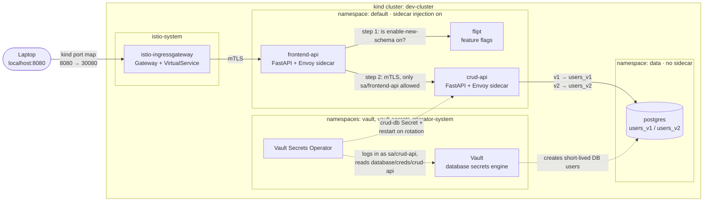
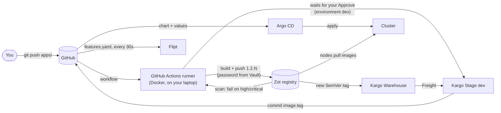
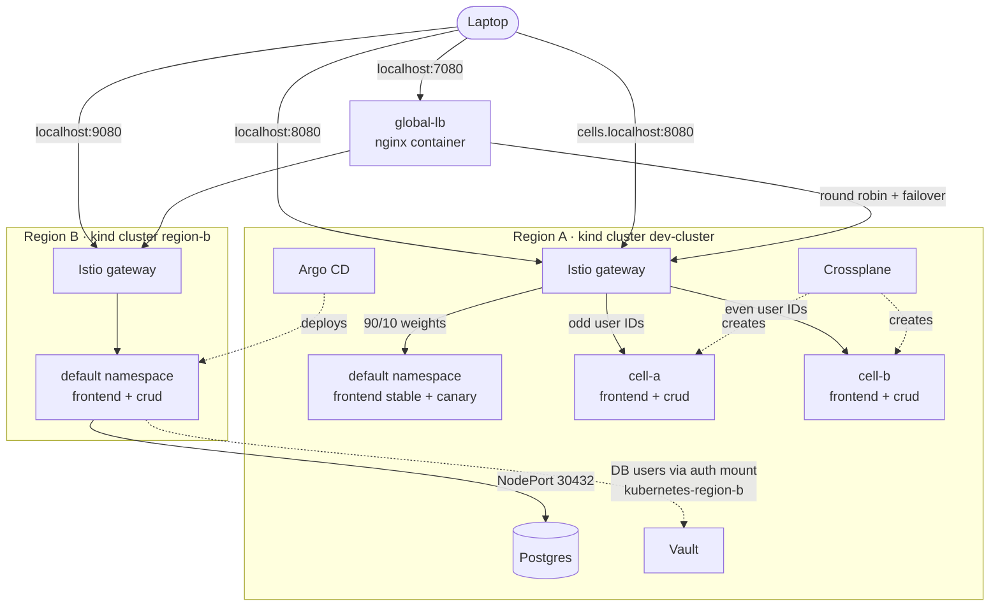

# local-eks-platform

A production-shaped Kubernetes platform that runs on a laptop. Two Python APIs sit behind an Istio ingress gateway. A feature flag in Flipt decides which database schema the frontend reads. Images live in a private Zot registry, Kargo promotes new versions, and Argo CD deploys everything from this Git repo.

It's meant for learning how the usual EKS building blocks fit together without a cloud account: service mesh, GitOps, feature flags, autoscaling, canary releases, image promotion, secrets management, cell-based architecture with Crossplane, and a second region with failover.

**No secrets are stored in this repo.** Database users, the registry login and Kargo's GitHub token all live in HashiCorp Vault (see [Secrets](#secrets)).

## New to this? The pieces in plain words

| Piece | In plain words | What it does here |
|---|---|---|
| **Kubernetes** | A manager for your apps: you describe what should run, and it keeps that true, restarting anything that dies. | Runs everything below, in local "clusters" made by kind. |
| **Pod / Deployment / Service** | A pod is a running copy of your app; a Deployment keeps N pods alive; a Service is the stable name other apps call. | `frontend-api` and `crud-api` each have all three. |
| **Helm** | A form with blanks (the chart) plus one filled-in copy per app (a values file). | One chart, `charts/base-api`, builds both APIs. |
| **Istio** | Gives every app a personal assistant (the *sidecar*) that encrypts calls and checks who's calling, plus a receptionist (the *gateway*) at the front door. | `localhost:8080` goes through the gateway; crud-api only accepts calls from the frontend. |
| **Flipt** | Light switches for features: the code has both paths, a flag picks one, no redeploy needed. | `enable-new-schema` chooses between the v1 and v2 database tables. |
| **Argo CD** | A thermostat set by Git: it keeps comparing the cluster with Git, and fixes any difference. | Deploys everything in `k8s-manifests/`; undoes manual changes. |
| **Zot** | A private warehouse for app images; a tag like `1.1.2` is the label on a box. | Stores the app images at `localhost:5001` and scans them for known vulnerabilities. |
| **GitHub Actions (CI)** | A factory line that starts on every code push: builds, inspects, stores, then waits for your approval. | Builds and scans both images on a runner on your laptop, pushes them to Zot, asks Kargo to promote. |
| **Kargo** | A release manager: notices new images and, when you approve, moves a version environment by environment, writing each move into Git. | Promotes `frontend-api` to `dev`, then to `region-b`. |
| **Vault** | A safe that hands out short-lived keys instead of shared passwords. | Creates a temporary database user for each crud-api. |
| **Crossplane** | Lets you define your own "order form" (here a `Cell`) that expands into many resources. | One `Cell` becomes a namespace, two apps, credentials and access rules. |

Kubernetes is new to you? Start with **Setup** below, then work through [How to test each component](#how-to-test-each-component) from the top. Each section builds on the one before.

## Architecture

### Request flow

A call to `http://localhost:8080/users/1` takes this path:



1. kind forwards `localhost:8080` to NodePort 30080 on the control-plane node, where the Istio ingress gateway listens.
2. The gateway's `VirtualService` sends every path to `frontend-api-svc`.
3. The frontend asks Flipt whether `enable-new-schema` is on for this user.
4. It calls `crud-api` at `/api/v2/...` if the flag is on, or `/api/v1/...` if it's off. The two sidecars encrypt this call with mutual TLS. An `AuthorizationPolicy` only lets the frontend's ServiceAccount through.
5. `crud-api` reads `users_v1` or `users_v2` from Postgres, logging in as a short-lived, read-only user that Vault created for it (dotted lines).

### Delivery flow

How a code change becomes a running pod. You do two things: push, and approve.



1. You push a change under `apps/`. GitHub starts `.github/workflows/build.yml` on the self-hosted runner in Docker on your laptop.
2. The runner builds both images as `1.2.<run number>`, reads the registry password from Vault, and pushes them to Zot.
3. Zot scans them. Any high or critical vulnerability fails the run.
4. The run waits in the `dev` environment until you click **Approve** on GitHub.
5. The runner asks Kargo to promote the new version (Freight) to the `dev` Stage.
6. Kargo sets `image.tag` in `frontend-values.yaml`, commits as "Kargo", pushes, and asks Argo CD to sync.
7. Argo CD renders the Helm chart and rolls out the Deployment; the kind nodes pull the image from Zot.
8. Later, you promote the same version to `region-b` (Kargo refuses until `dev` has it).

Git stays the record of what runs where: every promotion is a commit you can read, revert or audit.

### Regions and cells



- **Region A** (`dev-cluster`) runs everything, including the shared services: Postgres, Vault, Zot, Argo CD, Kargo and Crossplane.
- **Region B** (`region-b`) runs its own gateway, frontend, crud-api and Flipt. It reads region A's Postgres and gets DB users from region A's Vault. Argo CD in region A deploys it.
- **Cells** are complete copies of the app stack inside region A, each serving a slice of users. A `Cell` resource (Crossplane) creates one.
- **global-lb** spreads requests across both regions and retries in the other region if one fails, like Route 53 failover routing would.

## Components

| Component | Version | Namespace | What it does here |
|---|---|---|---|
| [kind](https://kind.sigs.k8s.io/) | v0.33.0 (Kubernetes v1.34.11) | – | Runs the cluster as Docker containers: 1 control-plane, 2 workers. |
| [Istio](https://istio.io/) | 1.31.1 | `istio-system` | Ingress gateway, sidecar proxies, mesh-wide STRICT mTLS and authorization policies. |
| [Argo CD](https://argo-cd.readthedocs.io/) | v3.5.3 | `argocd` | Keeps the cluster in sync with this repo, with automatic sync, prune and self-heal. |
| [Flipt](https://www.flipt.io/) | v1.61.1 | `default` | Evaluates feature flags. Reads `feature-flags/` from GitHub (read-only, git storage). |
| Postgres | 17 | `data` | Holds the `users_v1` and `users_v2` tables, seeded on first start. |
| [Vault](https://developer.hashicorp.com/vault) | 2.0.4 (chart 0.34.1) | `vault` | Issues short-lived Postgres users; stores the registry login and Kargo's GitHub token. |
| [Vault Secrets Operator](https://developer.hashicorp.com/vault/docs/platform/k8s/vso) | 1.6.0 | `vault-secrets-operator-system` | Copies secrets from Vault into Kubernetes Secrets, and restarts apps when they change. |
| [Zot](https://zotregistry.dev/) | v2.1.21 | `registry` | Private OCI registry for the app images: TLS, anonymous pull, authenticated push, web UI, vulnerability scanning. |
| [GitHub Actions](https://docs.github.com/actions) runner | 2.337.0 | Docker container `github-runner` | Runs the CI workflow on your laptop: builds, scans, pushes to Zot, promotes via Kargo. |
| [Kargo](https://kargo.io/) | 1.11.4 | `kargo` | Watches Zot for new `frontend-api` tags and promotes them into `dev` through Git. |
| [cert-manager](https://cert-manager.io/) | v1.21.2 | `cert-manager` | Issues Zot's TLS certificate (from a cluster-local CA) and Kargo's webhook certificates. |
| [metrics-server](https://github.com/kubernetes-sigs/metrics-server) | latest chart | `kube-system` | Supplies CPU metrics to the HPAs. |
| [Crossplane](https://www.crossplane.io/) | v2.4.2 | `crossplane-system` | Provides the `Cell` API: one small resource becomes a namespace, two Argo CD apps, DB credentials and an access policy. |
| nginx (global-lb) | 1.29 | Docker container | Global load balancer on `localhost:7080` across both regions' gateways, with failover. |
| [Argo Rollouts](https://argoproj.github.io/rollouts/) | v1.10.0 | `argo-rollouts` | Progressive delivery (canary, blue/green). Installed for Kargo verification, not used yet. |

### The apps

| App | What it does | Endpoints |
|---|---|---|
| `frontend-api` | The public API. Asks Flipt which schema to use, then calls `crud-api`. | `GET /users/{id}`, `GET /healthz` |
| `crud-api` | Reads users from Postgres. Only reachable from `frontend-api`. | `GET /api/v1/users/{id}`, `GET /api/v2/users/{id}`, `GET /healthz` |

Both are FastAPI apps listening on port 8000, deployed from `localhost:5001/<app>:<version>`. From 1.1.1 the images build on [Chainguard's Python image](https://images.chainguard.dev/directory/image/python/overview): no shell or package manager, non-root user, and **0 known vulnerabilities** in Zot's scan (1.0.0, on `python:3.13-slim`, had 71). `frontend-api` returns an `x-app-version` header so you can see which version answered. Configuration comes from environment variables set in the Helm values files. `crud-api` reads `DB_USER` and `DB_PASSWORD` from the `crud-db` Secret, which the Vault Secrets Operator creates and keeps up to date.

## Repository layout

```
local-eks-platform/
├── .github/workflows/build.yml  # CI: build, scan, push, approve, promote
├── azure-pipelines.yml          # The same pipeline in Azure DevOps syntax (not connected; for comparison)
├── apps/
│   ├── frontend-api/            # FastAPI app, Dockerfile, requirements.txt
│   └── crud-api/                # FastAPI app, Dockerfile, requirements.txt
├── feature-flags/
│   └── features.yaml            # Flipt flags, read from GitHub by Flipt
├── k8s-manifests/
│   ├── charts/base-api/         # One Helm chart for both APIs:
│   │                            #   Deployment, Service, HPA, ServiceAccount
│   └── environments/dev/
│       ├── frontend-values.yaml # frontend values (image, env); Kargo updates image.tag
│       ├── frontend-canary-values.yaml # canary on/off + tag, layered on frontend-values
│       ├── crud-values.yaml     # crud values (image, env, which Secret keys to read)
│       ├── argocd-apps.yaml     # Argo CD Applications for region A
│       ├── networking/          # Istio Gateway, VirtualService, AuthorizationPolicy
│       ├── data/                # Postgres StatefulSet + seed SQL (no credentials)
│       ├── secrets/             # Vault Secrets Operator resources for crud-db
│       ├── registry/            # Zot: TLS certs, config, Deployment, NodePort 30500
│       ├── kargo/               # Kargo Project, Warehouse, Stages (dev, region-b), Git credentials
│       ├── crossplane/          # The Cell API: XRD, Composition, functions, RBAC
│       ├── cells/               # Cell a and Cell b
│       ├── regions/             # NodePorts region B uses for Vault and Postgres
│       └── region-b/            # Region B: values overrides, networking, secrets, Argo CD apps
├── platform/vault/              # Helm values for Vault
├── platform/global-lb/          # nginx config for the global load balancer
├── platform/github-runner/      # Dockerfile for the self-hosted CI runner
├── scripts/
│   ├── bootstrap-vault.sh       # Install + configure Vault; `unseal` after restarts
│   ├── setup-registry.sh        # Registry login in Vault, node mirrors, docker login
│   ├── set-kargo-git-token.sh   # Store Kargo's GitHub token in Vault (hidden prompt)
│   ├── setup-region.sh          # Register region-b with Argo CD and Vault; start global-lb
│   ├── setup-ci.sh              # Build + register the CI runner; repo safety settings; approval environment
│   ├── flag.sh                  # Ask Flipt about the flag in plain English (flag.sh 1, flag.sh users)
│   ├── check-expiry.sh          # When the CI token, Kargo's GitHub token and certificates expire
│   └── lib.sh                   # Shared helpers
├── kind-config.yaml             # Region A: ports 8080, 8443, 5001; registry mirrors
├── kind-config-region-b.yaml    # Region B: ports 9080, 9443
├── istio-config.yaml            # Istio install overlay (gateway as NodePort 30080/30443)
└── istio-mtls.yaml              # Mesh-wide STRICT mTLS
```

Argo CD Applications in `argocd-apps.yaml`:

| Application | Source | Deploys |
|---|---|---|
| `frontend-api-dev` | `charts/base-api` + `frontend-values.yaml` | frontend Deployment, Service, HPA, ServiceAccount |
| `crud-api-dev` | `charts/base-api` + `crud-values.yaml` | crud Deployment, Service, HPA, ServiceAccount |
| `platform-networking-dev` | `environments/dev/networking/` | Gateway, VirtualService, AuthorizationPolicy |
| `postgres-dev` | `environments/dev/data/` | Postgres StatefulSet, Service, seed SQL |
| `vault-secrets-dev` | `environments/dev/secrets/` | Resources that produce the `crud-db` Secret |
| `registry-dev` | `environments/dev/registry/` | Zot and its certificates and login |
| `kargo-dev` | `environments/dev/kargo/` | Kargo Project, Warehouse, Stages and Git credentials |
| `frontend-api-canary-dev` | `charts/base-api` + `frontend-values.yaml` + `frontend-canary-values.yaml` | The frontend canary Deployment (nothing when `canary.enabled: false`) |
| `crossplane-dev` | `environments/dev/crossplane/` | The `Cell` API |
| `cells-dev` | `environments/dev/cells/` | `Cell` a and b; Crossplane then creates `cell-<name>-frontend-api` and `cell-<name>-crud-api` apps |
| `cross-region-dev` | `environments/dev/regions/` | NodePorts 30820 (Vault) and 30432 (Postgres) for region B |
| `region-b-*` (4 apps) | `environments/region-b/` + the chart | Region B's frontend, crud-api, networking and DB credentials, deployed to the `region-b` cluster |

## Setup from scratch

**Prerequisites:** Docker, `kind`, `kubectl`, `helm`, `istioctl` 1.31.x and Bash. On Windows, use Git Bash (see [Windows notes](#windows-notes)).

> **Docker on cgroup v1** (for example Docker Desktop on an older WSL2 kernel) can't run Kubernetes 1.35 or later. That's why `kind-config.yaml` pins v1.34.11.

```bash
# 1. Cluster (also maps localhost:5001 to the registry and enables registry mirrors)
kind create cluster --name dev-cluster --config=kind-config.yaml

# 2. Istio + sidecar injection + STRICT mTLS
istioctl install -f istio-config.yaml -y
kubectl label namespace default istio-injection=enabled
kubectl apply -f istio-mtls.yaml

# 3. Argo CD (server-side apply: one CRD is too large for client-side apply)
kubectl create namespace argocd
kubectl apply -n argocd --server-side --force-conflicts \
  -f https://raw.githubusercontent.com/argoproj/argo-cd/v3.5.3/manifests/install.yaml

# 4. cert-manager (Zot's TLS) and metrics-server (HPAs; kind needs --kubelet-insecure-tls)
helm upgrade --install cert-manager oci://quay.io/jetstack/charts/cert-manager \
  --version v1.21.2 -n cert-manager --create-namespace --set crds.enabled=true --wait
helm repo add metrics-server https://kubernetes-sigs.github.io/metrics-server/
helm upgrade --install metrics-server metrics-server/metrics-server -n kube-system \
  --set 'args={--kubelet-insecure-tls}'

# 5. Flipt, reading flags from this repo
helm repo add flipt https://helm.flipt.io
helm upgrade --install flipt flipt/flipt -n default \
  --set flipt.config.storage.type=git \
  --set flipt.config.storage.git.repository=https://github.com/mandar33/local-eks-platform.git \
  --set flipt.config.storage.git.ref=main \
  --set flipt.config.storage.git.directory=feature-flags

# 6. Argo Rollouts and Kargo. Type the Kargo admin password at the hidden prompt.
kubectl create namespace argo-rollouts
kubectl apply -n argo-rollouts --server-side --force-conflicts \
  -f https://github.com/argoproj/argo-rollouts/releases/download/v1.10.0/install.yaml
read -rsp "Kargo admin password: " PASS; echo
HASH=$(printf '%s\n' "$PASS" | docker run --rm -i httpd:2.4-alpine htpasswd -niBC 10 "" | tr -d ':\r\n'); unset PASS
helm upgrade --install kargo oci://ghcr.io/akuity/kargo-charts/kargo --version 1.11.4 \
  -n kargo --create-namespace \
  --set api.adminAccount.passwordHash="$HASH" \
  --set api.adminAccount.tokenSigningKey="$(openssl rand -base64 48)" --wait
unset HASH

# 7. Hand the rest to Argo CD. Some apps wait for steps 8-10; that's expected.
kubectl apply -n argocd -f k8s-manifests/environments/dev/argocd-apps.yaml

# 8. Vault: installs Vault + the operator, creates the Postgres admin password,
#    connects Vault to Postgres and rotates that password.
scripts/bootstrap-vault.sh

# 9. Registry: push login in Vault, containerd mirrors on the nodes, docker login
scripts/setup-registry.sh

# 10. Build and push the app images
for app in frontend-api crud-api; do
  docker build -t localhost:5001/$app:1.0.0 apps/$app
  docker push localhost:5001/$app:1.0.0
done

# 11. Kargo's GitHub token (fine-grained: this repo only, Contents read/write)
scripts/set-kargo-git-token.sh

# 12. Crossplane, for cells (the crossplane-dev and cells-dev apps do the rest)
helm repo add crossplane-stable https://charts.crossplane.io/stable
helm upgrade --install crossplane crossplane-stable/crossplane --version 2.4.2 \
  -n crossplane-system --create-namespace --wait

# 13. CI: runner in Docker, registered with `gh` (must be logged in as the repo owner)
scripts/setup-ci.sh

kubectl get applications -n argocd -w     # wait for everything: Synced / Healthy
```

<details>
<summary>Optional: region B and the global load balancer</summary>

Region B needs about 2 GB more memory.

```bash
kind create cluster --name region-b --config=kind-config-region-b.yaml
kubectl config use-context kind-region-b
istioctl install -f istio-config.yaml -y
kubectl label namespace default istio-injection=enabled
kubectl apply -f istio-mtls.yaml
helm upgrade --install flipt flipt/flipt -n default \
  --set flipt.config.storage.type=git \
  --set flipt.config.storage.git.repository=https://github.com/mandar33/local-eks-platform.git \
  --set flipt.config.storage.git.ref=main --set flipt.config.storage.git.directory=feature-flags
helm upgrade --install metrics-server metrics-server/metrics-server -n kube-system --set 'args={--kubelet-insecure-tls}'
helm upgrade --install vault-secrets-operator hashicorp/vault-secrets-operator --version 1.6.0 \
  -n vault-secrets-operator-system --create-namespace --wait
kubectl config use-context kind-dev-cluster

# Region B's nodes pull from region A's Zot
CLUSTER=region-b REGISTRY_HOST=dev-cluster-control-plane scripts/setup-registry.sh nodes

# Register region B with Argo CD and Vault, start global-lb on localhost:7080
scripts/setup-region.sh
kubectl apply -n argocd -f k8s-manifests/environments/region-b/argocd-apps.yaml
```

</details>

What waits for what, so nothing surprises you:

- `postgres-0` waits for the `postgres-admin` Secret (step 8).
- `crud-api` waits for `crud-db` (step 8) and both apps wait for their images (step 10), showing `ImagePullBackOff` until then.
- `registry-dev` and `kargo-dev` retry until the Vault Secrets Operator exists (step 8).
- Kargo can't push commits until step 11.

**After Docker or the laptop restarts:** Vault starts sealed. Run `scripts/bootstrap-vault.sh unseal`.

### Windows notes

- **Use Git Bash, not PowerShell.** The commands and scripts are Bash. In PowerShell, `KUBECTL="..." script.sh` fails with "not recognized as the name of a cmdlet". To start a script from PowerShell anyway:
  ```powershell
  & "C:\Program Files\Git\bin\bash.exe" -lc 'cd ~/Downloads/local-eks-platform && scripts/set-kargo-git-token.sh'
  ```
  Don't put double quotes inside the single-quoted part: Windows PowerShell 5.1 strips them. Set variables first with `$env:NAME = '...'`.
- **Antivirus HTTPS scanning** (for example Norton Web Shield) breaks kubectl, helm and git with `x509: certificate signed by unknown authority`. Exclude those programs from HTTPS scanning. Until then, all scripts accept a `KUBECTL` override that runs kubectl inside the control-plane container:
  ```bash
  export KUBECTL="docker exec -i dev-cluster-control-plane kubectl --kubeconfig /etc/kubernetes/admin.conf"
  scripts/bootstrap-vault.sh unseal
  ```
  For git: `git config --global http.sslBackend schannel`.
- **Port 8081** is often taken (JFrog Artifactory uses it), so the Argo CD UI below uses 8090.

## How to test each component

For tests from inside the mesh, start a throwaway pod once. It gets a sidecar like any app in `default`:

```bash
kubectl run curl -n default --image=curlimages/curl --restart=Never --command -- sleep 86400
kubectl wait pod/curl --for=condition=Ready --timeout=120s
```

### End to end

```bash
curl localhost:8080/users/1
# {"id":1,"experimental_data":{"name":"Alice","tier":"gold","schema":"v2"}}
```

`experimental_data` means the flag is on and the request reached the v2 endpoint.

### Helm (one chart, two apps)

Both APIs come from `charts/base-api`. Only the values files differ. Helm runs locally; no cluster needed.

```bash
helm lint k8s-manifests/charts/base-api -f k8s-manifests/environments/dev/frontend-values.yaml
# 1 chart(s) linted, 0 chart(s) failed

# What Argo CD will apply for the frontend
helm template frontend-api k8s-manifests/charts/base-api \
  -f k8s-manifests/environments/dev/frontend-values.yaml | grep -E "^kind:|^  name:"
# kind: ServiceAccount / Service / Deployment / HorizontalPodAutoscaler

# Same chart, different values: compare images and env vars
for v in frontend crud; do echo "[$v]"
  helm template x k8s-manifests/charts/base-api -f k8s-manifests/environments/dev/$v-values.yaml \
    | grep -E "image:|- name: [A-Z_]+$"; done
# [frontend] CRUD_API_URL, FLIPT_URL      [crud] DB_HOST, DB_NAME, DB_PORT, DB_PASSWORD, DB_USER

# See exactly what one extra value changes
diff <(helm template x k8s-manifests/charts/base-api -f k8s-manifests/environments/dev/frontend-values.yaml) \
     <(helm template x k8s-manifests/charts/base-api -f k8s-manifests/environments/dev/frontend-values.yaml --set env.LOG_LEVEL=debug)
# >         - name: LOG_LEVEL
# >           value: "debug"
```

To make a change permanent, put it in the values file and push. Argo CD renders the chart the same way.

### Ingress gateway

```bash
curl -s -o /dev/null -D - localhost:8080/users/1 | grep -iE "server|x-envoy"
# server: istio-envoy
# x-envoy-upstream-service-time: 33

curl -s -o /dev/null -w "%{http_code}\n" localhost:8080/api/v1/users/1
# 404   (crud-api is not exposed; only the frontend is routed)
```

Routing, rewrites, timeouts, retries and fault injection all go in the `VirtualService` in `k8s-manifests/environments/dev/networking/istio-networking.yaml`.

### Service-to-service (mTLS + authorization)

```bash
# The curl pod runs as sa/default, which the AuthorizationPolicy doesn't allow
kubectl exec curl -c curl -- curl -s -w " [%{http_code}]\n" http://crud-api-svc/api/v1/users/1
# RBAC: access denied [403]

# Plaintext (sent from the sidecar container itself) is rejected by STRICT mTLS
kubectl exec curl -c istio-proxy -- curl -s http://crud-api-svc/api/v1/users/1; echo "exit $?"
# exit 56   (connection reset)

# Services without a policy accept any mesh caller
kubectl exec curl -c curl -- curl -s http://frontend-api-svc/healthz
# {"status":"ok"}
```

### Feature flags (Flipt)

```bash
scripts/flag.sh 1          # user 1   ON   (no rule matched, so the flag's default)
scripts/flag.sh 2 beta     # the same question for a user on the "beta" plan
scripts/flag.sh users      # users 1 to 8 at once
```

`flag.sh` asks Flipt exactly what the frontend asks, from a small in-cluster pod, and prints the answer in plain English. The raw call is a `POST` to `http://flipt.default.svc.cluster.local:8080/evaluate/v1/boolean` with `{"namespaceKey":"default","flagKey":"enable-new-schema","entityId":"1","context":{}}`.

To change a flag, edit `feature-flags/features.yaml`, commit and push. Flipt picks it up within about 30 seconds (17 in testing). Region B runs its own Flipt, so for a few seconds the two regions can give different answers. For example, set `enabled: false` and `curl localhost:8080/users/1` returns `{"id":1,"standard_data":"Alice (v1 schema)"}`. Percentage rollouts and segments go under `rollouts:` on the flag. See the [Flipt docs](https://docs.flipt.io/).

If Flipt crash-loops after a push, the file has a field Flipt doesn't accept. `kubectl logs deploy/flipt -c flipt` names the line.

### Argo CD

The clearest way to see Argo CD work: change one number in Git and watch the cluster follow. Set `minReplicas: 2` in `frontend-values.yaml`, commit, push, then `kubectl get pods -l app=frontend-api -w`. A second pod appeared 129 seconds later in testing (Argo CD's regular check of Git). Revert it and make Argo CD look straight away with `kubectl annotate application frontend-api-dev -n argocd argocd.argoproj.io/refresh=normal --overwrite`: 3 seconds. Note that the cells use the same values file, so they follow the change too.

```bash
kubectl get applications -n argocd                 # all Synced / Healthy

# Self-heal: delete something Argo CD manages and watch it come back
kubectl delete svc crud-api-svc && kubectl get svc crud-api-svc
# crud-api-svc   ClusterIP   ...   1s

# UI at https://localhost:8090 (user: admin)
kubectl port-forward svc/argocd-server -n argocd 8090:443
kubectl -n argocd get secret argocd-initial-admin-secret -o jsonpath="{.data.password}" | base64 -d; echo
```

**Rolling back** is a Git revert: `git revert <commit> && git push`, and Argo CD applies the previous state. Argo CD checks Git every few minutes (80 seconds in testing); to make it check now:

```bash
kubectl annotate application frontend-api-dev -n argocd argocd.argoproj.io/refresh=normal --overwrite
```

A hand-made revert isn't known to Kargo, which still lists the newer Freight for `dev`. To roll back a promoted version properly, promote the older Freight in Kargo. For about a minute after any rollout, the app shows `Degraded` and Kargo's Stage `Unhealthy`, because the new pod has no CPU metrics yet.

### CI (GitHub Actions)

```bash
docker ps --filter name=github-runner          # the runner
gh run list --limit 3                          # recent runs
gh run watch                                   # follow a run live
```

Try it: change `healthz` in `apps/frontend-api/main.py` to return `{"status": "ok", "hello": "from CI"}`, commit and push. The run builds and scans both images as `1.2.<run number>`, then waits. Approve it on GitHub (Actions → the run → **Review deployments** → dev → **Approve and deploy**). Then:

```bash
git pull && git log --oneline -1       # dev: frontend-api 1.2.3 (promoted by Kargo)
curl -s -D - localhost:8080/healthz    # x-app-version: 1.2.3 ... {"status":"ok","hello":"from CI"}
```

Tested end to end, including the undo (run 4, `1.2.4`). The first real fix shipped this way was crud-api's `pool_pre_ping`, for a `connection is closed` error after idle periods.

**Security on a public repo.** The runner executes code on your laptop, and anyone can open a pull request on a public repo. So the workflow runs only on pushes to `main` and manual starts, never on pull requests; outside contributors' runs need approval; and the runner holds only a Vault token that can read the registry password and a Kubernetes identity (`ci-promoter`) that can only create Kargo promotions. GitHub stores no secrets for it.

**Coming from Azure DevOps?** `azure-pipelines.yml` is the same pipeline in Azure Pipelines syntax, with a mapping table at the top (trigger ↔ `on`, stages/jobs ↔ jobs, agent pool ↔ runner labels, deployment job + environment approvals ↔ `environment:` with required reviewers, `$(Build.BuildId)` ↔ `github.run_number`). It isn't connected to anything; it's there to compare.

### Hardened images

```bash
q() { curl -sk -X POST https://localhost:5001/v2/_zot/ext/search -H 'Content-Type: application/json' \
  -d "{\"query\":\"{ CVEListForImage(image: \\\"$1\\\") { Summary { Count HighCount } } }\"}"; echo; }
q frontend-api:1.0.0     # {"Count":71,"HighCount":10}   python:3.13-slim
q frontend-api:1.1.1     # {"Count":0,"HighCount":0}     Chainguard python, pip removed
```

The first Chainguard build (1.1.0) still had 3. They were in pip, which the build copied into the app. The Dockerfile now uninstalls pip after installing dependencies. The runtime image has no shell, so `kubectl exec ... -- sh` doesn't work in these containers; debug with `kubectl debug` or logs instead.

### Canary release (Istio)

The frontend has a second Deployment, `frontend-api-canary`, controlled by `frontend-canary-values.yaml`. Istio splits gateway traffic between the `stable` and `canary` pods by weight (`networking/istio-networking.yaml`), and the header `x-canary: always` forces the canary.

```bash
# 1. Pods first: canary.enabled: true and image.tag: <new tag> in frontend-canary-values.yaml;
#    commit, push, wait for `kubectl get deploy frontend-api-canary` to show 1/1.
# 2. Then traffic: stable/canary weights 90/10 in both VirtualServices; commit, push.
# 3. Count which version answers
for i in $(seq 1 200); do curl -s -o /dev/null -D - localhost:8080/users/1 | grep -i '^x-app-version' ; done | sort | uniq -c
#     174 x-app-version: <stable tag>
#      26 x-app-version: <canary tag>      (about 10%)
curl -s -o /dev/null -D - -H 'x-canary: always' localhost:8080/users/1 | grep -i '^x-app-version'
# 4. Happy? Promote the same tag to stable with Kargo (below).
# 5. Reverse order to switch off: weights back to 100/0 (commit, push, wait), then canary.enabled: false.
```

**Why pods and weights go in separate commits:** in one commit, Argo CD may apply the weights before the canary pods exist, and that 10% of users gets `503`. Tested under continuous traffic: one commit gave 7 errors; two commits (on, and later off) gave 0 out of 267.

### Cells (Crossplane)

```bash
kubectl get cells                                   # NAME  FRONTEND  CRUD   SYNCED  READY
                                                    # a     1.1.1     1.1.1  True    True
# Odd user IDs go to cell a, even to cell b; x-cell pins a request
for u in 1 2 3 4; do curl -s -o /dev/null -D - http://cells.localhost:8080/users/$u | grep -i '^x-cell'; done
# x-cell: a / x-cell: b / x-cell: a / x-cell: b
curl -s -D - -H 'x-cell: b' http://cells.localhost:8080/users/1 | grep -i '^x-cell'

# Cells are isolated: cell a's frontend identity can't call cell b's crud-api
kubectl run xcell -n cell-a --image=curlimages/curl --restart=Never \
  --overrides='{"spec":{"serviceAccountName":"frontend-api"}}' --command -- sleep 300
kubectl exec -n cell-a xcell -c xcell -- curl -s http://crud-api-svc.cell-b.svc.cluster.local/api/v1/users/1
# RBAC: access denied
kubectl delete pod xcell -n cell-a
```

**Add a cell:** copy a `Cell` in `k8s-manifests/environments/dev/cells/cells.yaml` with a new name, push, and add a route for it in the `cell-router` VirtualService. Crossplane creates the namespace, both Argo CD apps, the Vault credential resources and the access policy. Each cell gets its own DB user; cells share the one Postgres to save memory. A production cell would also have its own data store.

If `cells.localhost` doesn't resolve on your machine, use `curl -H 'Host: cells.localhost' localhost:8080/users/1`.

### Multi-region

```bash
curl -s -D - localhost:8080/users/2 | grep -i x-region    # x-region: a
curl -s -D - localhost:9080/users/2 | grep -i x-region    # x-region: b

# The global load balancer spreads requests
for i in $(seq 1 40); do curl -s -o /dev/null -D - localhost:7080/users/1 | grep -i '^x-region'; done | sort | uniq -c
#   20 x-region: a
#   20 x-region: b

# Failover: take region A's gateway down while requests keep flowing
kubectl scale deploy istio-ingressgateway -n istio-system --replicas=0
for i in $(seq 1 20); do curl -s -o /dev/null -w '%{http_code} ' -D - localhost:7080/users/1 | grep -i '^x-region'; done | sort | uniq -c
#   20 x-region: b          (all 200)
kubectl scale deploy istio-ingressgateway -n istio-system --replicas=1
```

Measured here: 176 requests during a 25-second region A outage, all returned 200.

**Releases go region by region.** Kargo's `region-b` Stage only accepts Freight that `dev` (region A) already has:

```bash
# Promoting a new tag straight to region-b is refused:
#   spec.freight: Invalid value: ...: Freight is not available to this Stage
# Promote to dev first, then region-b. Each promotion is a Kargo commit:
#   dev: frontend-api 1.1.2 (promoted by Kargo)
#   region-b: frontend-api 1.1.2 (promoted by Kargo)
```

What's simplified: region B has no database or Vault of its own, so region A is still a single point of failure for data. Real multi-region setups replicate the database and run Vault per region (or use a managed service), and often connect the service meshes (Istio multi-cluster) so services can fail over individually.

### Autoscaling (HPA)

The Deployments don't set `replicas`, so the HPA owns the replica count and Argo CD doesn't reset it. Generate load from inside the mesh and watch it scale:

```bash
kubectl run load --image=busybox:1.37 --restart=Never --command -- sh -c \
  'for i in 1 2 3 4 5 6 7 8; do (while true; do wget -q -O- http://frontend-api-svc/users/1 >/dev/null 2>&1; done) & done; wait'

kubectl get hpa frontend-api-hpa -w
# cpu: 2%/70%     1   3   1
# cpu: 197%/70%   1   3   1
# cpu: 549%/70%   1   3   3     <- scaled to the max within about 40 seconds

kubectl delete pod load
```

After the load stops, replicas drop back to 1 once the HPA's 5-minute scale-down window passes. `crud-api-hpa` rises too, because every frontend request calls crud.

### Vault database credentials

```bash
# The operator's view: has it fetched credentials?
kubectl get vaultdynamicsecret crud-db
# NAME      SYNCED   HEALTHY   READY
# crud-db   True     True      True

# The username Vault generated for crud-api (don't print the password)
kubectl get secret crud-db -o jsonpath='{.data.username}' | base64 -d; echo
# v-kubernet-crud-api-y43L26afNrQM0wCIXvdG-1790373574

# Restart Vault: it comes back sealed, the app keeps serving, then unseal it
kubectl delete pod vault-0 -n vault
kubectl exec -n vault vault-0 -- vault status | grep Sealed     # Sealed  true
curl -s -o /dev/null -w "%{http_code}\n" localhost:8080/users/1  # 200
scripts/bootstrap-vault.sh unseal                               # Vault unsealed.
```

What was verified on this cluster:

- The issued user can `SELECT` from `users_v1` and `users_v2`, but gets `must be owner of table` when trying `DROP` or `DELETE`.
- The bootstrap admin password in `postgres-admin` is rejected (`password authentication failed`) after Vault rotates it. Only Vault knows the current one.
- Credentials last 1 hour and are renewed up to 24 hours. After that, Vault issues a new user, the operator updates `crud-db` and restarts `crud-api`.

Vault UI: `kubectl port-forward -n vault svc/vault 8200:8200`, then open `http://localhost:8200` and sign in with the root token from `~/.local-eks-platform/vault-init.json`.

### Registry (Zot)

```bash
# Anyone can read
curl -sk https://localhost:5001/v2/_catalog
# {"repositories":["crud-api","frontend-api"]}
curl -sk https://localhost:5001/v2/frontend-api/tags/list
# {"name":"frontend-api","tags":["1.0.0","1.0.1"]}

# Nobody can push without the login
curl -sk -o /dev/null -w "%{http_code}\n" -X POST https://localhost:5001/v2/frontend-api/blobs/uploads/
# 401

# Log Docker in (password comes from Vault on stdin), then push
scripts/setup-registry.sh login
docker tag localhost:5001/frontend-api:1.0.1 localhost:5001/frontend-api:1.0.2
docker push localhost:5001/frontend-api:1.0.2

# Known vulnerabilities in an image (Zot scans with Trivy)
curl -sk -X POST https://localhost:5001/v2/_zot/ext/search -H 'Content-Type: application/json' \
  -d '{"query":"{ CVEListForImage(image: \"frontend-api:1.0.0\") { Summary { Count CriticalCount HighCount MediumCount LowCount } } }"}'
# {"data":{"CVEListForImage":{"Summary":{"Count":71,"CriticalCount":0,"HighCount":10,...}}}}
```

The web UI is at `https://localhost:5001`. The browser warns about the certificate because it comes from the cluster's own CA. The first vulnerability scan waits for Zot to download the Trivy database (about 900 MB, once).

### Kargo (image promotion)

```bash
# UI at https://localhost:8444 (user: admin, the password from setup step 6)
kubectl port-forward svc/kargo-api -n kargo 8444:443

# Every tag the Warehouse found in Zot becomes Freight
kubectl get freight -n local-eks-platform \
  -o jsonpath='{range .items[*]}{.alias}: {.images[0].tag}{"\n"}{end}'
# exhaling-mole: 1.0.0
# eloping-wombat: 1.0.1

# Promote a tag to dev without the UI
FREIGHT=$(kubectl get freight -n local-eks-platform \
  -o jsonpath='{range .items[?(@.images[0].tag=="1.0.1")]}{.metadata.name}{end}')
cat <<EOF | kubectl create -f -
apiVersion: kargo.akuity.io/v1alpha1
kind: Promotion
metadata:
  generateName: dev-
  namespace: local-eks-platform
spec:
  stage: dev
  freight: $FREIGHT
EOF
kubectl get promotions -n local-eks-platform     # PHASE: Succeeded
```

After a successful promotion:

- GitHub shows a commit by **Kargo**: `dev: frontend-api 1.0.1 (promoted by Kargo)`.
- `kubectl get stage dev -n local-eks-platform` shows `Freight has been verified`.
- `kubectl get deploy frontend-api -o jsonpath='{.spec.template.spec.containers[0].image}'` shows `localhost:5001/frontend-api:1.0.1`.
- Run `git pull` before your next local commit, since Kargo pushed to `main`.

**Shipping a real code change** is the same loop: edit `apps/frontend-api`, then `docker build -t localhost:5001/frontend-api:1.0.2 apps/frontend-api && docker push localhost:5001/frontend-api:1.0.2`, and promote the new Freight.

## Renewals

Two credentials expire and must be renewed by hand. `scripts/check-expiry.sh` prints the current dates (secrets never leave Vault; it only reads the expiry).

| Credential | Expires | Symptom | Renew with |
|---|---|---|---|
| CI runner's Vault token | 30 days after `setup-ci.sh` (next: 2026-10-26) | CI fails at "Log in to Zot" with `403` | `scripts/setup-ci.sh runner` |
| Kargo's GitHub token | The date chosen on GitHub (next: 2026-12-25) | Promotions fail with `Invalid username or token` | New fine-grained token (this repo, Contents read/write), then `scripts/set-kargo-git-token.sh` |
| Vault seal | Every Docker or laptop restart | `vault-0` shows `0/1` | `scripts/bootstrap-vault.sh unseal` |

Renewed automatically: crud-api's DB users (hourly), Zot's TLS certificate (2027) and the registry CA (2036; after it renews, run `scripts/setup-registry.sh nodes` once).

## Troubleshooting

| Symptom | Cause | Fix |
|---|---|---|
| `x509: certificate signed by unknown authority` from kubectl, helm or git | Antivirus HTTPS scanning is intercepting TLS | See [Windows notes](#windows-notes) |
| `... is not recognized as the name of a cmdlet` | Bash syntax typed into PowerShell | Use Git Bash, or the PowerShell form in [Windows notes](#windows-notes) |
| `argocd-applicationset-controller` in CrashLoopBackOff | Argo CD installed with client-side apply; ApplicationSet CRD missing | Re-apply with `--server-side --force-conflicts` |
| kind fails at "Starting control-plane" | Kubernetes ≥ 1.35 on a cgroup v1 host | Use the pinned v1.34 image, or switch WSL2 to cgroup v2 |
| Flipt CrashLoopBackOff | Invalid field in `features.yaml` on GitHub | Check `kubectl logs deploy/flipt -c flipt`, fix, push |
| `403 RBAC: access denied` calling crud-api | AuthorizationPolicy: only `sa/frontend-api` may call it | Expected. Edit `networking/istio-networking.yaml` to allow more callers |
| Empty reply from `localhost:8080` | No Gateway/VirtualService applied | Check `kubectl get gateway,virtualservice -A` and the `platform-networking-dev` app |
| HPA shows `<unknown>` | metrics-server missing | Install it with `--kubelet-insecure-tls` |
| `crud-api` stuck in `CreateContainerConfigError` | `crud-db` Secret doesn't exist yet | Run `scripts/bootstrap-vault.sh`; check `kubectl get vaultdynamicsecret crud-db` |
| `vault-0` Running but `0/1` Ready | Vault is sealed (it seals on every restart) | `scripts/bootstrap-vault.sh unseal` |
| `ImagePullBackOff` for `localhost:5001/...` | Image not pushed, or node mirrors not set up | `curl -sk https://localhost:5001/v2/_catalog`; re-run `scripts/setup-registry.sh nodes` |
| `docker push` fails with `manifest invalid` | Zot rejects Docker v2 manifests unless `compat: docker2s2` is set | Already set in `registry/zot.yaml`; check the ConfigMap was synced |
| Kargo promotion `Errored`: `Invalid username or token` | Bad GitHub token in Vault (for example pasted twice) | Re-run `scripts/set-kargo-git-token.sh` and paste once; the script now rejects malformed tokens |
| Kargo `git push` rejected (non-fast-forward) | Someone pushed to `main` between clone and push | Promote again |
| `password authentication failed` for a `v-kubernet-crud-api-...` user after Vault was sealed | The operator stopped renewing while Vault was sealed and the DB user expired | `scripts/bootstrap-vault.sh unseal` now restarts the operator; on older setups run `kubectl rollout restart deploy -n vault-secrets-operator-system vault-secrets-operator-controller-manager` |
| App `Degraded`, Kargo Stage `Unhealthy`, for about a minute after a rollout | The new pod has no CPU metrics yet, so its HPA can't report | Wait; it clears by itself |
| A pushed change isn't live yet | Argo CD checks Git every few minutes | Click Refresh, or `kubectl annotate application <app> -n argocd argocd.argoproj.io/refresh=normal --overwrite` |
| Argo CD sync fails with `field is immutable` on a Deployment `selector` | The chart changed the Deployment's labels (for example adding `track`) | Delete the Deployment once; Argo CD recreates it (a few seconds of downtime) |
| Disabled canary still running, app `OutOfSync` | Argo CD won't auto-sync an app down to zero resources | `allowEmpty: true` on the canary app (already set) |
| `Cell` stays `READY False` | Crossplane only sees a `Ready` condition; Argo CD apps and AuthorizationPolicies don't have one | The Composition sets readiness from Argo CD health (already set) |
| CI run stuck in "Queued" | The runner container isn't running | `docker ps -a --filter name=github-runner`; `scripts/setup-ci.sh runner` recreates it |
| CI fails at "Log in to Zot" with `403` from Vault | The runner's Vault token expired (30 days) or Vault is sealed | `scripts/bootstrap-vault.sh unseal`, then `scripts/setup-ci.sh runner` |
| CI stops at the scan step | Zot found a high or critical vulnerability | Update the base image or the dependency it names, push again |
| A single `500` after the app sat idle, then fine | Stale DB connection closed by the sidecar (fixed in crud-api 1.2.2 with `pool_pre_ping`) | Use crud-api 1.2.2 or later |
| `global-lb` doesn't start from Git Bash | Docker for Windows got a `/c/...` path | Fixed in `setup-region.sh` with `cygpath` |

## Secrets

### How this repo handles them

**Nothing secret is committed.** The repo contains only *references* to secrets: which Secret an app reads, and which Vault path it comes from. The values are created at runtime:

| Secret | Created by | Stored in | Who can read it |
|---|---|---|---|
| Postgres admin password | `bootstrap-vault.sh` (random, 32 chars) | Vault; the original is left in the `data/postgres-admin` Secret but no longer works | Vault only, after `rotate-root` |
| `crud-api` DB user + password | Vault's database engine, on request | `default/crud-db` Secret, written by the Vault Secrets Operator | `crud-api` pods |
| Registry push login (`pusher`) | `setup-registry.sh` (random) | Vault `kv/registry/pusher`; Zot gets only a bcrypt hash via `kv/registry/htpasswd` | You, through `setup-registry.sh login` |
| Kargo's GitHub token | You, at a hidden prompt | Vault `kv/kargo/github`, copied to `local-eks-platform/github-creds` | Kargo |
| CI runner's Vault token | `setup-ci.sh` (policy `ci-registry`: read `kv/registry/pusher` only, 30 days) | Inside the `github-runner` container only | The runner |
| CI runner's Kubernetes identity | ServiceAccount `ci-promoter` (read Freight, create Promotions) | Kubeconfig inside the `github-runner` container only | The runner |
| Region B's Argo CD and Vault reviewer tokens | `setup-region.sh`, as ServiceAccount tokens in region B | `argocd/cluster-region-b` Secret; Vault `auth/kubernetes-region-b/config` | Argo CD; Vault |
| Vault unseal key + root token | `vault operator init` | `~/.local-eks-platform/vault-init.json`, outside the repo | You |
| Argo CD admin password | Argo CD install | `argocd/argocd-initial-admin-secret` | Cluster admins |
| Kargo admin password | You, at a hidden prompt | Only its bcrypt hash, in the Kargo release | You |

How `crud-api` gets its credentials:

1. The Vault Secrets Operator authenticates to Vault with a token for `crud-api`'s ServiceAccount (Kubernetes auth, role `crud-api`, audience `vault`).
2. Vault's policy lets that role read only `database/creds/crud-api`.
3. Reading that path makes Vault create a brand-new Postgres user with `SELECT` on two tables. The user expires on its own (`VALID UNTIL`).
4. The operator writes the username and password to the `crud-db` Secret. The Deployment maps them to `DB_USER` and `DB_PASSWORD`.
5. The operator renews the lease. When it can't be renewed any more, it fetches a new user and restarts `crud-api`. Vault drops the old user when its lease expires.

A leaked `crud-db` password is therefore read-only, limited to one database, and dead within a day at most. Zot and Kargo follow the same pattern: each has its own ServiceAccount and Vault role that can read only its own secret.

### Rules for contributors

- Never commit a password, token, key or `.env` file. `.gitignore` blocks the usual file names. The [gitleaks](https://github.com/gitleaks/gitleaks) pre-commit hook blocks the rest: `pip install pre-commit && pre-commit install`.
- Put a new app secret in Vault, then add a `VaultStaticSecret` or `VaultDynamicSecret` under `k8s-manifests/environments/dev/`. Reference it from the values file with `secretEnv`, as `crud-values.yaml` does.
- Pass secrets to CLIs on stdin or at a hidden prompt (`read -rs`), not as command-line arguments. Arguments show up in shell history and process lists.
- Give tokens the least access that works: Kargo's GitHub token should be fine-grained, limited to this repository, with only **Contents: Read and write**.
- Turn on GitHub [secret scanning and push protection](https://docs.github.com/en/code-security/secret-scanning) for the repo.
- If a secret is ever committed, **rotate it first**. Rewriting history doesn't make a leaked secret safe again.

### What changes for a real environment

This setup trades some safety for running on a laptop. Before using the pattern anywhere real:

- **Auto-unseal Vault** with a cloud KMS (AWS KMS on EKS) instead of a single unseal key in a local file, and run Vault HA with Raft storage.
- **Retire the root token** after setup (`vault token revoke`). Give people OIDC logins with narrow policies.
- **Turn on TLS** for Vault's listener, and use `sslmode=verify-full` for the Postgres connection. Both are plain TCP inside the cluster here.
- **Require a login to pull images**, with `imagePullSecrets` delivered from Vault, and have Kargo trust the registry CA instead of using `insecureSkipTLSVerify`.
- **Build and push images from CI**, not laptops, and sign them (cosign or Notation). Zot can verify signatures.
- **Use managed identity where it exists.** On EKS, IRSA or EKS Pod Identity with RDS IAM authentication can remove static database passwords entirely.
- **Serve HTTPS at the gateway.** It serves plain HTTP on port 80 today; add a TLS `Gateway` server with a cert-manager certificate.
