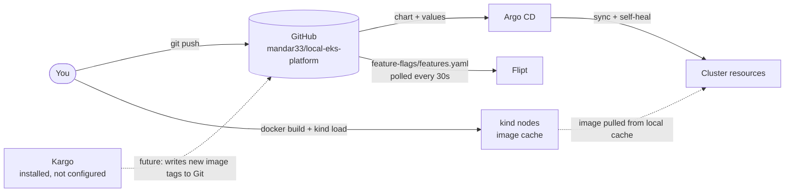

# local-eks-platform

A production-shaped Kubernetes platform that runs on a laptop. Two Python APIs sit behind an Istio ingress gateway. A feature flag in Flipt decides which database schema the frontend reads. Argo CD deploys everything from this Git repo.

It's meant for learning how the usual EKS building blocks fit together (service mesh, GitOps, feature flags, autoscaling, secrets management) without a cloud account. **No secrets are stored in this repo.** Database credentials are issued at runtime by HashiCorp Vault (see [Secrets](#secrets)).

## Architecture

### Request flow

A call to `http://localhost:8080/users/1` takes this path:


1. kind forwards `localhost:8080` to NodePort 30080 on the control-plane node, where the Istio ingress gateway listens.
2. The gateway's `VirtualService` sends every path to `frontend-api-svc`.
3. The frontend asks Flipt whether `enable-new-schema` is on for this user.
4. It calls `crud-api` at `/api/v2/...` if the flag is on, or `/api/v1/...` if it's off. The two sidecars encrypt this call with mutual TLS. An `AuthorizationPolicy` only lets the frontend's ServiceAccount through.
5. `crud-api` reads `users_v1` or `users_v2` from Postgres, logging in as a short-lived, read-only user that Vault created for it (dotted lines).

### Delivery flow (GitOps)



Argo CD deploys what Git says, including the image tag. Tags are set by hand today (`frontend-api:dev`), and images are loaded straight into the nodes with `kind load`, because there's no registry or CI yet. Kargo is installed so it can take over tag updates once a registry exists.

## Components

| Component | Version | Namespace | What it does here |
|---|---|---|---|
| [kind](https://kind.sigs.k8s.io/) | v0.33.0 (Kubernetes v1.34.11) | – | Runs the cluster as Docker containers: 1 control-plane, 2 workers. |
| [Istio](https://istio.io/) | 1.31.1 | `istio-system` | Ingress gateway, sidecar proxies, mesh-wide STRICT mTLS and authorization policies. |
| [Argo CD](https://argo-cd.readthedocs.io/) | v3.5.3 | `argocd` | Keeps the cluster in sync with this repo, with automatic sync, prune and self-heal. |
| [Flipt](https://www.flipt.io/) | v1.61.1 | `default` | Evaluates feature flags. Reads `feature-flags/` from GitHub (read-only, git storage). |
| Postgres | 17 | `data` | Holds the `users_v1` and `users_v2` tables, seeded on first start. |
| [Vault](https://developer.hashicorp.com/vault) | 2.0.4 (chart 0.34.1) | `vault` | Issues short-lived Postgres users through its database secrets engine. Owns the Postgres admin password. |
| [Vault Secrets Operator](https://developer.hashicorp.com/vault/docs/platform/k8s/vso) | 1.6.0 | `vault-secrets-operator-system` | Fetches credentials from Vault into Kubernetes Secrets, and restarts apps when they rotate. |
| [metrics-server](https://github.com/kubernetes-sigs/metrics-server) | latest chart | `kube-system` | Supplies CPU metrics to the HPAs. |
| [Kargo](https://kargo.io/) | 1.11.4 | `kargo` | Promotes releases between environments. Installed, not configured yet. |
| [cert-manager](https://cert-manager.io/) | v1.21.2 | `cert-manager` | Issues webhook certificates for Kargo. |
| [Argo Rollouts](https://argoproj.github.io/rollouts/) | v1.10.0 | `argo-rollouts` | Progressive delivery (canary, blue/green) for Kargo verification. Installed, not used yet. |

### The apps

| App | What it does | Endpoints |
|---|---|---|
| `frontend-api` | The public API. Asks Flipt which schema to use, then calls `crud-api`. | `GET /users/{id}`, `GET /healthz` |
| `crud-api` | Reads users from Postgres. Only reachable from `frontend-api`. | `GET /api/v1/users/{id}`, `GET /api/v2/users/{id}`, `GET /healthz` |

Both are FastAPI apps listening on port 8000. Configuration comes from environment variables set in the Helm values files. `crud-api` reads `DB_USER` and `DB_PASSWORD` from the `crud-db` Secret, which the Vault Secrets Operator creates and keeps up to date.

## Repository layout

```
local-eks-platform/
├── apps/
│   ├── frontend-api/            # FastAPI app, Dockerfile, requirements.txt
│   └── crud-api/                # FastAPI app, Dockerfile, requirements.txt
├── feature-flags/
│   └── features.yaml            # Flipt flags, read from GitHub by Flipt
├── k8s-manifests/
│   ├── charts/base-api/         # One Helm chart for both APIs:
│   │                            #   Deployment, Service, HPA, ServiceAccount
│   └── environments/dev/
│       ├── frontend-values.yaml # frontend-specific values (image, env)
│       ├── crud-values.yaml     # crud-specific values (image, env, which Secret keys to read)
│       ├── argocd-apps.yaml     # The five Argo CD Applications
│       ├── networking/          # Istio Gateway, VirtualService, AuthorizationPolicy
│       ├── data/                # Postgres StatefulSet + seed SQL (no credentials)
│       └── secrets/             # VaultConnection, VaultAuth, VaultDynamicSecret for crud-db
├── platform/vault/              # Helm values for Vault
├── scripts/bootstrap-vault.sh   # Installs + configures Vault; generates all secrets at runtime
├── kind-config.yaml             # Cluster layout + localhost:8080/8443 port maps
├── istio-config.yaml            # Istio install overlay (gateway as NodePort 30080/30443)
└── istio-mtls.yaml              # Mesh-wide STRICT mTLS
```

Argo CD Applications in `argocd-apps.yaml`:

| Application | Source | Deploys |
|---|---|---|
| `frontend-api-dev` | `charts/base-api` + `frontend-values.yaml` | frontend Deployment, Service, HPA, ServiceAccount |
| `crud-api-dev` | `charts/base-api` + `crud-values.yaml` | crud Deployment, Service, HPA, ServiceAccount |
| `platform-networking-dev` | `environments/dev/networking/` | Gateway, VirtualService, AuthorizationPolicy |
| `postgres-dev` | `environments/dev/data/` | Postgres StatefulSet, Service, seed SQL |
| `vault-secrets-dev` | `environments/dev/secrets/` | Vault Secrets Operator resources that produce the `crud-db` Secret |

## Setup from scratch

**Prerequisites:** Docker, `kind`, `kubectl`, `helm`, `istioctl` 1.31.x and Git Bash (on Windows). The commands use Bash syntax.

> **Docker on cgroup v1** (for example Docker Desktop on an older WSL2 kernel) can't run Kubernetes 1.35 or later. That's why `kind-config.yaml` pins v1.34.11.

```bash
# 1. Cluster
kind create cluster --name dev-cluster --config=kind-config.yaml

# 2. Istio + sidecar injection + STRICT mTLS
istioctl install -f istio-config.yaml -y
kubectl label namespace default istio-injection=enabled
kubectl apply -f istio-mtls.yaml

# 3. Argo CD (server-side apply: one CRD is too large for client-side apply)
kubectl create namespace argocd
kubectl apply -n argocd --server-side --force-conflicts \
  -f https://raw.githubusercontent.com/argoproj/argo-cd/v3.5.3/manifests/install.yaml

# 4. metrics-server (kind needs --kubelet-insecure-tls)
helm repo add metrics-server https://kubernetes-sigs.github.io/metrics-server/
helm upgrade --install metrics-server metrics-server/metrics-server -n kube-system \
  --set 'args={--kubelet-insecure-tls}'

# 5. Flipt, reading flags from this repo
helm repo add flipt https://helm.flipt.io
helm upgrade --install flipt flipt/flipt -n default \
  --set flipt.config.storage.type=git \
  --set flipt.config.storage.git.repository=https://github.com/mandar33/local-eks-platform.git \
  --set flipt.config.storage.git.ref=main \
  --set flipt.config.storage.git.directory=feature-flags

# 6. Build the app images and load them into the kind nodes
docker build -t frontend-api:dev apps/frontend-api
docker build -t crud-api:dev apps/crud-api
kind load docker-image frontend-api:dev crud-api:dev --name dev-cluster

# 7. Hand the rest to Argo CD
kubectl apply -n argocd -f k8s-manifests/environments/dev/argocd-apps.yaml

# 8. Vault: installs Vault + the operator, generates the Postgres admin
#    password, connects Vault to Postgres and rotates that password.
#    Prints where the unseal key and root token were saved (outside the repo).
scripts/bootstrap-vault.sh

kubectl get applications -n argocd -w     # wait for all five: Synced / Healthy
```

Until step 8 finishes, `postgres-0` waits for its `postgres-admin` Secret and `crud-api` waits for `crud-db`. That's expected.

Vault seals itself whenever its pod restarts, for example after Docker or the laptop restarts. Unseal it with `scripts/bootstrap-vault.sh unseal`.

<details>
<summary>Optional: Kargo and its dependencies</summary>

```bash
helm upgrade --install cert-manager oci://quay.io/jetstack/charts/cert-manager \
  --version v1.21.2 -n cert-manager --create-namespace --set crds.enabled=true --wait

kubectl create namespace argo-rollouts
kubectl apply -n argo-rollouts --server-side --force-conflicts \
  -f https://github.com/argoproj/argo-rollouts/releases/download/v1.10.0/install.yaml

# Kargo requires an admin password hash and a token signing key.
# Type the password at the prompt so it never lands in shell history or a file.
read -rsp "Kargo admin password: " PASS; echo
HASH=$(htpasswd -bnBC 10 "" "$PASS" | tr -d ':\n'); unset PASS
KEY=$(openssl rand -base64 48)
helm upgrade --install kargo oci://ghcr.io/akuity/kargo-charts/kargo --version 1.11.4 \
  -n kargo --create-namespace \
  --set api.adminAccount.passwordHash="$HASH" \
  --set api.adminAccount.tokenSigningKey="$KEY" --wait
unset HASH KEY
```

</details>

## How to test each component

For tests from inside the mesh, start a throwaway pod once. It gets a sidecar like any app in `default`:

```bash
kubectl run curl -n default --image=curlimages/curl --restart=Never --command -- sleep 86400
kubectl wait pod/curl --for=condition=Ready --timeout=120s
```

### End to end

```bash
curl localhost:8080/users/1
# {"id":1,"experimental_data":{"name":"Alice","tier":"gold","schema":"v2"}}
```

`experimental_data` means the flag is on and the request reached the v2 endpoint.

### Ingress gateway

```bash
curl -s -o /dev/null -D - localhost:8080/users/1 | grep -iE "server|x-envoy"
# server: istio-envoy
# x-envoy-upstream-service-time: 33

curl -s -o /dev/null -w "%{http_code}\n" localhost:8080/api/v1/users/1
# 404   (crud-api is not exposed; only the frontend is routed)
```

Routing, rewrites, timeouts, retries and fault injection all go in the `VirtualService` in `k8s-manifests/environments/dev/networking/istio-networking.yaml`.

### Service-to-service (mTLS + authorization)

```bash
# The curl pod runs as sa/default, which the AuthorizationPolicy doesn't allow
kubectl exec curl -c curl -- curl -s -w " [%{http_code}]\n" http://crud-api-svc/api/v1/users/1
# RBAC: access denied [403]

# Plaintext (sent from the sidecar container itself) is rejected by STRICT mTLS
kubectl exec curl -c istio-proxy -- curl -s http://crud-api-svc/api/v1/users/1; echo "exit $?"
# exit 56   (connection reset)

# Services without a policy accept any mesh caller
kubectl exec curl -c curl -- curl -s http://frontend-api-svc/healthz
# {"status":"ok"}
```

### Feature flags (Flipt)

```bash
kubectl exec curl -c curl -- curl -s -X POST \
  http://flipt.default.svc.cluster.local:8080/evaluate/v1/boolean \
  -H 'Content-Type: application/json' \
  -d '{"namespaceKey":"default","flagKey":"enable-new-schema","entityId":"1","context":{}}'
# {"enabled":true, "reason":"DEFAULT_EVALUATION_REASON", ...}
```

To change a flag, edit `feature-flags/features.yaml`, commit and push. Flipt picks it up within about 30 seconds. For example, set `enabled: false` and `curl localhost:8080/users/1` returns `{"id":1,"standard_data":"Alice (v1 schema)"}`. Percentage rollouts and segments go under `rollouts:` on the flag. See the [Flipt docs](https://docs.flipt.io/).

If Flipt crash-loops after a push, the file has a field Flipt doesn't accept. `kubectl logs deploy/flipt -c flipt` names the line.

### Argo CD

```bash
kubectl get applications -n argocd                 # all five: Synced / Healthy

# Self-heal: delete something Argo CD manages and watch it come back
kubectl delete svc crud-api-svc && kubectl get svc crud-api-svc
# crud-api-svc   ClusterIP   ...   1s

# UI at https://localhost:8081 (user: admin)
kubectl port-forward svc/argocd-server -n argocd 8081:443
kubectl -n argocd get secret argocd-initial-admin-secret -o jsonpath="{.data.password}" | base64 -d
```

**Shipping a code change:** build with a *new* tag, load it, update the tag in Git, then push:

```bash
docker build -t frontend-api:0.2.0 apps/frontend-api
kind load docker-image frontend-api:0.2.0 --name dev-cluster
# edit k8s-manifests/environments/dev/frontend-values.yaml → image.tag: 0.2.0
git commit -am "frontend-api 0.2.0" && git push
```

Rebuilding the same `dev` tag won't roll out, because nothing in Git changed. Use `kubectl rollout restart deploy/frontend-api` if you really need to.

### Vault database credentials

```bash
# The operator's view: has it fetched credentials?
kubectl get vaultdynamicsecret crud-db
# NAME      SYNCED   HEALTHY   READY
# crud-db   True     True      True

# The username Vault generated for crud-api (don't print the password)
kubectl get secret crud-db -o jsonpath='{.data.username}' | base64 -d; echo
# v-kubernet-crud-api-y43L26afNrQM0wCIXvdG-1790373574

# Vault's side: active leases for crud-api credentials
ROOT_TOKEN=$(sed -n 's/.*"root_token": *"\([^"]*\)".*/\1/p' ~/.local-eks-platform/vault-init.json)
printf '%s\n' "$ROOT_TOKEN" | kubectl exec -i -n vault vault-0 -- \
  sh -c 'read -r VAULT_TOKEN; export VAULT_TOKEN; vault list sys/leases/lookup/database/creds/crud-api'
unset ROOT_TOKEN
```

What was verified on this cluster:

- The issued user can `SELECT` from `users_v1` and `users_v2`, but gets `must be owner of table` when trying `DROP` or `DELETE`.
- The bootstrap admin password in `postgres-admin` is rejected (`password authentication failed`) after Vault rotates it. Only Vault knows the current one.
- Credentials last 1 hour and are renewed up to 24 hours. After that, Vault issues a new user, the operator updates `crud-db` and restarts `crud-api`.

Vault UI: `kubectl port-forward -n vault svc/vault 8200:8200`, then open `http://localhost:8200` and sign in with the root token from `~/.local-eks-platform/vault-init.json`.

### Autoscaling

```bash
kubectl get hpa
# crud-api-hpa       Deployment/crud-api       cpu: 2%/70%   1   3   1
# frontend-api-hpa   Deployment/frontend-api   cpu: 2%/70%   1   3   1
```

The Deployments don't set `replicas`, so the HPA owns the replica count and Argo CD doesn't reset it.

### Kargo

Kargo is installed but has no Project, Warehouse or Stage yet. To try it:

- Push images to a registry it can watch, such as `ghcr.io/mandar33/frontend-api:1.0.0`. Images loaded with `kind load` are invisible to it.
- Give it a GitHub token (a Secret labelled `kargo.akuity.io/cred-type: git`).
- Annotate `frontend-api-dev` with `kargo.akuity.io/authorized-stage: <project>:<stage>`.

A Stage then clones the repo, updates `image.tag` in `frontend-values.yaml`, commits, pushes and triggers an Argo CD sync. UI: `kubectl port-forward svc/kargo-api -n kargo 8444:443`, then open `https://localhost:8444`.

## Troubleshooting

| Symptom | Cause | Fix |
|---|---|---|
| `x509: certificate signed by unknown authority` from kubectl, helm or git | Antivirus HTTPS scanning (for example Norton Web Shield) is intercepting TLS | Exclude those tools from HTTPS scanning. For git: `git config --global http.sslBackend schannel` |
| `argocd-applicationset-controller` in CrashLoopBackOff | Argo CD installed with client-side apply; ApplicationSet CRD missing | Re-apply with `--server-side --force-conflicts` |
| kind fails at "Starting control-plane" | Kubernetes ≥ 1.35 on a cgroup v1 host | Use the pinned v1.34 image, or switch WSL2 to cgroup v2 |
| Flipt CrashLoopBackOff | Invalid field in `features.yaml` on GitHub | Check `kubectl logs deploy/flipt -c flipt`, fix, push |
| `403 RBAC: access denied` calling crud-api | AuthorizationPolicy: only `sa/frontend-api` may call it | Expected. Edit `networking/istio-networking.yaml` to allow more callers |
| Empty reply from `localhost:8080` | No Gateway/VirtualService applied | Check `kubectl get gateway,virtualservice -A` and the `platform-networking-dev` app |
| HPA shows `<unknown>` | metrics-server missing | Install it with `--kubelet-insecure-tls` |
| `crud-api` stuck in `CreateContainerConfigError` | `crud-db` Secret doesn't exist yet | Run `scripts/bootstrap-vault.sh`; check `kubectl get vaultdynamicsecret crud-db` |
| `vault-0` Running but `0/1` Ready; `crud-db` stops updating | Vault is sealed (it seals on every restart) | `scripts/bootstrap-vault.sh unseal` |
| `postgres-0` stuck in `CreateContainerConfigError` | `postgres-admin` Secret missing | Run `scripts/bootstrap-vault.sh` (it creates it) |

## Secrets

### How this repo handles them

**Nothing secret is committed.** The repo contains only *references* to secrets: which Secret an app reads, and which Vault path it comes from. The values are created at runtime:

| Secret | Created by | Stored in | Who can read it |
|---|---|---|---|
| Postgres admin password | `bootstrap-vault.sh` (random, 32 chars) | Vault; the original is left in the `data/postgres-admin` Secret but no longer works | Vault only, after `rotate-root` |
| `crud-api` DB user + password | Vault's database engine, on request | `default/crud-db` Secret, written by the Vault Secrets Operator | `crud-api` pods |
| Vault unseal key + root token | `vault operator init` | `~/.local-eks-platform/vault-init.json`, outside the repo | You |
| Argo CD admin password | Argo CD install | `argocd/argocd-initial-admin-secret` | Cluster admins |
| Kargo admin password | You, at a hidden prompt | Only its bcrypt hash, in the Kargo release | You |

How `crud-api` gets its credentials:

1. The Vault Secrets Operator authenticates to Vault with a token for `crud-api`'s ServiceAccount (Kubernetes auth, role `crud-api`, audience `vault`).
2. Vault's policy lets that role read only `database/creds/crud-api`.
3. Reading that path makes Vault create a brand-new Postgres user with `SELECT` on two tables. The user expires on its own (`VALID UNTIL`).
4. The operator writes the username and password to the `crud-db` Secret. The Deployment maps them to `DB_USER` and `DB_PASSWORD`.
5. The operator renews the lease. When it can't be renewed any more, it fetches a new user and restarts `crud-api`. Vault drops the old user when its lease expires.

A leaked `crud-db` password is therefore read-only, limited to one database, and dead within a day at most.

### Rules for contributors

- Never commit a password, token, key or `.env` file. `.gitignore` blocks the usual file names. The [gitleaks](https://github.com/gitleaks/gitleaks) pre-commit hook blocks the rest: `pip install pre-commit && pre-commit install`.
- Put a new app secret in Vault, then add a `VaultStaticSecret` or `VaultDynamicSecret` under `k8s-manifests/environments/dev/secrets/`. Reference it from the values file with `secretEnv`, as `crud-values.yaml` does.
- Pass secrets to CLIs on stdin or at a hidden prompt (`read -rs`), not as command-line arguments. Arguments show up in shell history and process lists.
- Turn on GitHub [secret scanning and push protection](https://docs.github.com/en/code-security/secret-scanning) for the repo.
- If a secret is ever committed, **rotate it first**. Rewriting history doesn't make a leaked secret safe again.

### What changes for a real environment

This setup trades some safety for running on a laptop. Before using the pattern anywhere real:

- **Auto-unseal Vault** with a cloud KMS (AWS KMS on EKS) instead of a single unseal key in a local file, and run Vault HA with Raft storage.
- **Retire the root token** after setup (`vault token revoke`). Give people OIDC logins with narrow policies.
- **Turn on TLS** for Vault's listener, and use `sslmode=verify-full` for the Postgres connection. Both are plain TCP inside the cluster here.
- **Use managed identity where it exists.** On EKS, IRSA or EKS Pod Identity with RDS IAM authentication can remove static database passwords entirely.
- **Serve HTTPS at the gateway.** It serves plain HTTP on port 80 today; add a TLS `Gateway` server with a cert-manager certificate.
