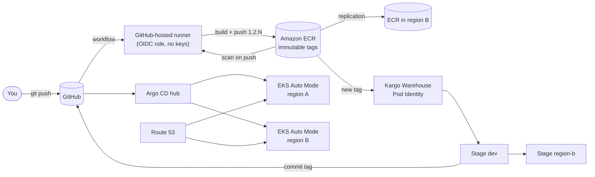

# Running this platform on EKS Auto Mode

How each part of this repo would behave on Amazon EKS Auto Mode, with Amazon ECR as the image repository, CI building and pushing to it, and Kargo and Argo CD doing delivery. Nothing here has been deployed to AWS; it's a design based on how the pieces behave locally and on AWS's documented behaviour. **Check the specifics marked "verify" against current AWS documentation**, because AWS changes defaults and limits over time.

## EKS Auto Mode in plain words

Normal EKS gives you a Kubernetes control plane, and you look after the machines (nodes) and the add-ons that make them useful. **Auto Mode also runs the nodes for you:** it picks instance types, starts nodes when pods can't be scheduled, removes them when they're empty, patches them, and replaces them regularly. Networking (VPC CNI), load balancers, block storage (EBS) and pod identity come built in.

The trade-off: nodes are locked down. There's no SSH, no logging in, and no changing a node's configuration. Anything in this repo that reaches into a node has to go.

## What changes, part by part

| Part | Here (kind, laptop) | On EKS Auto Mode | Effort |
|---|---|---|---|
| Cluster | `kind create cluster`, 3 Docker containers | EKS cluster with Auto Mode on; node pools `general-purpose` and `system` | New (Terraform/eksctl) |
| Nodes | Fixed; you can `docker exec` into them | Created and removed automatically; replaced at least every few weeks (verify: maximum node lifetime); no access | Plan for it (below) |
| Getting traffic in | NodePort 30080 + kind port map to `localhost:8080` | Istio gateway Service `type: LoadBalancer`: Auto Mode creates an AWS Network Load Balancer | Small change in `istio-config.yaml` |
| Istio | Sidecars, STRICT mTLS | Same. Sidecar injection works on Auto Mode nodes; consider Istio's ambient mode later | None |
| Image repository | Zot in the cluster, containerd mirror on each node | **Amazon ECR.** Nodes pull with their built-in IAM role; no node configuration needed (the mirror approach is impossible anyway) | Replace Zot |
| Vulnerability scan | Zot + Trivy | ECR scan on push, or Amazon Inspector enhanced scanning; CI reads the findings | Change the CI scan step |
| CI | GitHub Actions on a self-hosted runner in Docker (needed to reach `localhost:5001`) | **GitHub-hosted runners** can push to ECR directly. They log in to AWS with **OIDC** (a short-lived role, no stored keys). Or AWS CodeBuild. The self-hosted runner goes away | Rewrite the login and push steps |
| Kargo | Watches Zot, commits tags, asks Argo CD to sync | Same, but the Warehouse watches ECR (`<account>.dkr.ecr.<region>.amazonaws.com/frontend-api`). Kargo can get ECR credentials through EKS Pod Identity or IRSA (verify with Kargo's docs for your version). No `insecureSkipTLSVerify` needed | Small |
| Argo CD | In region A, reaches region B with a ServiceAccount token | Same shape (hub cluster manages spokes), but spokes are registered with IAM (`awsAuthConfig` + an EKS access entry) instead of long-lived tokens. AWS also offers a managed Argo CD option for EKS (verify availability and features) | Medium |
| Flipt | Reads flags from GitHub | Same. Alternative: AWS AppConfig | None |
| Postgres | StatefulSet in the cluster | **Amazon RDS / Aurora.** Across regions: Aurora Global Database (one writer, read replicas elsewhere), which fits crud-api's read-only access | Replace |
| Vault | Manual unseal, file storage | If kept: KMS auto-unseal (no more manual unseal) and Raft on EBS. Or replace with AWS Secrets Manager + External Secrets Operator, and **RDS IAM authentication** so crud-api needs no DB password at all | Medium |
| Storage (PVCs) | kind's local-path | EBS, through Auto Mode's built-in driver. StorageClasses must use Auto Mode's EBS provisioner name (verify: `ebs.csi.eks.amazonaws.com`) | Small |
| HPA | metrics-server installed by hand | Still needs metrics-server (verify whether your EKS version ships it as an add-on) | Small |
| Node autoscaling | None (fixed 3 nodes) | Built in: when the HPA adds pods that don't fit, Auto Mode adds nodes | Free |
| cert-manager | Issues Zot's certificate | Still useful (gateway TLS); AWS Certificate Manager for the load balancer is an alternative | None |
| Crossplane cells | Namespace + apps per cell | Same, and a Cell could also create AWS resources per cell (its own RDS database, queues) with Crossplane's AWS provider or ACK. Real cell designs often go further: one AWS account or cluster per cell | Optional |
| Two regions | Two kind clusters, NodePorts across the Docker network, nginx as global LB | Two EKS Auto Mode clusters in two AWS regions; ECR cross-region replication; **Route 53** failover or latency routing (or AWS Global Accelerator) instead of nginx | New |
| Local fixes | Norton, cgroup v1, Git Bash paths, `zot-proxy` | Gone | — |

## Behaviour to plan for on Auto Mode

1. **Nodes come and go.** Auto Mode consolidates underused nodes and replaces old ones, which evicts pods. With `minReplicas: 1` and no PodDisruptionBudget, each eviction is a short outage. Before moving, do the rolling-update hardening from `future-improvements.md`: `minReplicas: 2`, a PodDisruptionBudget (`minAvailable: 1`), `maxUnavailable: 0`, and a `preStop` sleep.
2. **You can't touch nodes.** Everything that used `docker exec` on a node goes away: `setup-registry.sh nodes`, `crictl`, the kind port maps. Debug through pods (`kubectl debug`, logs) and AWS tooling.
3. **Load balancers cost money and take a minute.** Each `type: LoadBalancer` Service creates an NLB. Keep a single Istio gateway per cluster and route inside it, as this repo already does.
4. **Scaling is two-level.** The HPA adds pods, and Auto Mode adds nodes for them. Scale-out takes longer when a new node is needed (typically under a minute or two), so set HPA targets with some headroom.
5. **Identity replaces tokens.** Pod Identity lets a pod assume an IAM role: Kargo reading ECR, crud-api connecting to RDS with IAM auth, Crossplane creating AWS resources. Most of this repo's long-lived tokens (CI Vault token, Argo CD's region-B token) become roles, which also removes most of the renewal list.
6. **ECR tags can be immutable.** Turn on tag immutability: pushing `1.2.5` twice is rejected, which enforces the "never reuse a tag" rule from the labs.

## The delivery flow on AWS

What stays exactly the same: Git as the source of truth, Helm chart and values files, Kargo's Warehouse, Freight and Stages (including "region B only after dev"), Argo CD Applications, Istio routing and canaries, Flipt flags, and the Crossplane Cell API.

## Suggested migration order

1. **ECR + CI:** create ECR repositories (immutable tags, scan on push, lifecycle rules), an IAM role for GitHub OIDC, and switch the workflow's login, push and scan steps. Keep pushing to Zot in parallel until it works.
2. **One EKS Auto Mode cluster** with Istio (gateway as `LoadBalancer`), Argo CD and Kargo. Point the Kargo Warehouse at ECR using Pod Identity.
3. **Data and secrets:** RDS with IAM auth for crud-api, or Vault with KMS auto-unseal.
4. **Resilience first, then scale:** PDBs, `minReplicas: 2`, `preStop`, before relying on Auto Mode's node replacement.
5. **Second region:** another Auto Mode cluster, ECR replication, Aurora Global Database, Route 53 failover, Kargo's `region-b` Stage pointed at it.
6. **Cells last:** decide whether a cell is a namespace (as here), a cluster, or an AWS account.
