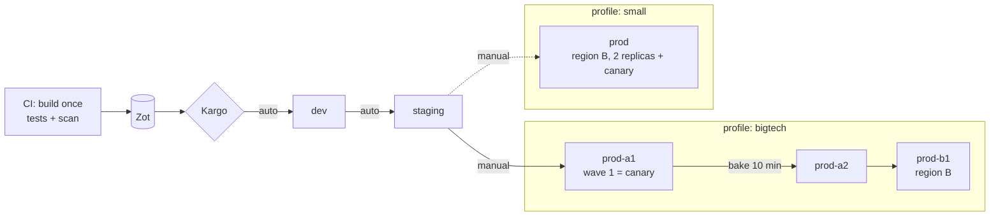

# Design: dev → staging → prod, big-tech style with a small-company switch

Status: **draft, not built yet.** Replaces the "Environments" bullet in [future-improvements.md](future-improvements.md). Built in phases (below), each one a small commit that leaves the platform working.

One platform, two **profiles**, chosen by one line in Git:

- **`bigtech`** (default): prod is made of **cells** spread over **two regions**, and a release goes out in **waves**: one cell first, a bake time, then the rest.
- **`small`**: prod is **one copy in one cluster**, with a canary. This is how a company with a handful of teams runs it.

dev and staging are the same in both. Only prod and the release path change.

## Why change

Today's layout grew one lab at a time:

- `dev` (namespace `default`) is also the main region-A copy. There is no staging and no real prod.
- Region B's crud-api reads region A's Postgres through a NodePort, so "prod-b" depends on "dev".
- One Postgres database, one Vault role and one Flipt flag set serve every copy. A bad migration or flag in dev hits everything.
- Cells exist in region A only, and each is a Crossplane Composition that only creates Kubernetes objects. That's a heavy layer for what Argo CD can do on its own.

## The two profiles

| | `small` | `bigtech` |
|---|---|---|
| Prod shape | One copy, `prod`, in the prod cluster | Cells: `prod-a1`, `prod-a2` in region A, `prod-b1` in region B |
| Replicas | 2 + PodDisruptionBudget | 1 per cell (redundancy comes from having several cells) |
| Canary | Canary Deployment, Istio weight 10% | The **first cell is the canary**: `prod-a1` gets the release alone |
| Release to prod | `staging` → `prod`, one manual approval | `staging` → `prod-a1` (manual) → bake 10 min → `prod-a2` → `prod-b1` |
| Routing | `localhost:9080` → prod | Cell router per region (user → cell); `localhost:7080` spreads across regions and fails over |
| Data | Database `crud_prod` | A database per cell: `crud_prod_a1`, `crud_prod_a2`, `crud_prod_b1` |
| Blast radius of a bad release | All users, until rollback | One cell's users |
| Real-world examples | Most startups and mid-size SaaS | AWS, Slack, Stripe, Salesforce |

Switching: `scripts/profile.sh bigtech|small` changes one line in Git and pushes. Argo CD then adds or removes the prod copies, and Kargo swaps its prod stages. dev, staging and the tools aren't touched.

## Layout

Two kind clusters, as today:

| Cluster | Runs |
|---|---|
| `dev-cluster` (region A, port 8080) | Tools (Argo CD, Kargo, Vault, Zot, CI runner); `dev`, `staging`; *bigtech:* cells `prod-a1`, `prod-a2` |
| `region-b` (region B, port 9080) | *small:* `prod`; *bigtech:* cell `prod-b1` |



### What each environment looks like

| | dev | staging | prod |
|---|---|---|---|
| Namespace | `dev` | `staging` | `prod`, or one per cell (`prod-a1` ...) |
| Address | `dev.localhost:8080` | `staging.localhost:8080` | *small:* `localhost:9080`; *bigtech:* `localhost:8080` (region A router), `localhost:9080` (region B router), `localhost:7080` (global) |
| Replicas | 1 | 1 | see profiles |
| Database | `crud_dev` | `crud_staging` | see profiles |
| Vault role | `crud-api-dev` | `crud-api-staging` | `crud-api-prod` (one per cluster auth mount) |
| Flags | Flipt namespace `dev` | Flipt namespace `staging` | Flipt namespace `prod` in each cluster |
| Promotion | automatic after CI | automatic once dev is healthy | manual first step, then waves (bigtech) |

App pods: *bigtech* 8 in region A + 2 in region B (today 7 + 2). *small* 4 in region A + 5 in region B. Crossplane goes away in both (see "Cells without Crossplane").

## How the switch works

**App of apps.** One Application, `root`, is applied by hand once. It syncs `k8s-manifests/argocd/`, which contains:

```text
k8s-manifests/argocd/
├── projects.yaml                # AppProjects nonprod, prod
├── common.yaml                  # tools, dev, staging, Postgres, Flipt, networking
├── profile.yaml                 # Application "prod": path argocd/profiles/<name>  ← the switch
└── profiles/
    ├── small/
    │   ├── prod-apps.yaml       # frontend-api-prod, crud-api-prod (+ canary) on region-b
    │   ├── networking.yaml      # plain route, canary weights
    │   └── kargo-stages.yaml    # prod (source: staging)
    └── bigtech/
        ├── cells.yaml           # ApplicationSet: one pair of apps per cell in the list
        ├── networking.yaml      # cell routers, region A and B
        └── kargo-stages.yaml    # prod-a1, prod-a2, prod-b1 (waves)
```

`scripts/profile.sh bigtech` changes the `path:` in `profile.yaml`, commits "profile: bigtech", pushes, and restarts `global-lb` with the matching nginx config. The Argo CD `prod` app prunes the old profile's resources and creates the new ones.

Data is disposable demo data (seeded tables), so switching creates the new databases and seeds them. Nothing is migrated between profiles.

### Cells without Crossplane

Locally a cell is only Kubernetes objects (two Helm releases and a few extras), so Crossplane adds a layer and memory without doing anything Argo CD can't. The replacement is lighter, multi-cluster out of the box, and the usual way companies fan apps out:

- An **Argo CD ApplicationSet** with a list of cells (`name`, `cluster`, `region`). For each cell it creates `frontend-api-<cell>` and `crud-api-<cell>`, deployed to any cluster.
- The **Helm chart** gains what the Composition used to add: the Vault Secrets Operator resources, the AuthorizationPolicy, and the namespace label for Istio (`CreateNamespace` + `managedNamespaceMetadata`).
- Kargo writes each cell's image tags to `apps/prod/cells/<cell>-values.yaml`.

Adding a cell = one line in `cells.yaml` + one values file + one database. That's exercise 10's "add a new cell".

Crossplane comes back on EKS, where it has a real job: a cell there also needs its own AWS resources (an RDS database, an SQS queue, an IAM role). Crossplane creates those per cell; the ApplicationSet still deploys the apps. See [eks-auto-mode.md](eks-auto-mode.md).

## Naming

`<what>-<env>` for dev and staging; `<what>-prod` (small) or `<what>-prod-<region><n>` (bigtech cells).

- Argo CD apps: `frontend-api-dev`, `crud-api-staging`, `frontend-api-prod`, `crud-api-prod-a1`
- Kargo stages: `dev`, `staging`, then `prod` or `prod-a1`, `prod-a2`, `prod-b1`
- Argo CD projects: `nonprod` (dev, staging) and `prod` (anything `prod*`)

## Folders

```text
k8s-manifests/
├── charts/base-api/                 # + optional VSO, AuthorizationPolicy, PDB templates
├── apps/
│   ├── common/                      # shared: repository, nameOverride, ports
│   ├── dev/  staging/               # image.tag (Kargo), URLs, replicas
│   └── prod/
│       ├── prod-values.yaml         # small
│       └── cells/prod-a1-values.yaml ...   # bigtech
├── platform/
│   ├── region-a/                    # Postgres, Flipt, networking, registry, secrets, kargo (shared stages)
│   └── region-b/                    # Postgres, Flipt, networking, secrets
└── argocd/                          # see above
```

## Release flow

1. Merge to `main` → CI runs tests, lint and an image scan, builds `frontend-api:1.2.N` and `crud-api:1.2.N` once, and pushes to Zot.
2. Kargo promotes the pair to **dev** automatically, and to **staging** once dev is healthy.
3. A person promotes to prod: `promote.sh prod 1.2.N` (small) or `promote.sh prod-a1 1.2.N` (bigtech).
4. *bigtech:* after `prod-a1` has been healthy for the bake time, Kargo promotes `prod-a2`, then `prod-b1`, automatically. A failed check stops the wave.
5. Rollback = promote the previous Freight. In bigtech, only the cells that got the bad release need it.

## Laptop simplifications

| Here | Big tech | Small company |
|---|---|---|
| Tools and dev/staging share region A's cluster with prod cells | Separate accounts per cell, tools in their own account | Separate prod account |
| One Vault for both clusters | Vault per region, or a cloud secrets manager | Cloud secrets manager |
| One Postgres per cluster, a database per cell | A database cluster per cell | One managed database (RDS) |
| Bake time 10 minutes | Hours to days per wave | – |
| Health = Argo CD Healthy (+ later Istio error rate) | Automated analysis on many metrics | Often a person watching dashboards |

## Migration plan

Each phase is one or two commits, and the apps keep serving. Every phase ends with a check (`curl`, Argo CD all green).

| # | Phase | What changes |
|---|---|---|
| 1 | **Folders, no behaviour change** | Values to `apps/common` + `apps/dev`, platform files to `platform/region-a` and `platform/region-b`. Update Argo CD and Kargo paths |
| 2 | **App of apps** | `root` app syncs `argocd/`; the hand-applied app lists go into it |
| 3 | **Chart does the cell extras** | VSO, AuthorizationPolicy, PDB and namespace label in `base-api` (off by default) |
| 4 | **dev gets its own namespace** ✅ | `dev`, `crud-api-dev`, `dev.localhost` (still the shared `crud` database) |
| 5 | **Add staging + a database per env** ✅ | `staging`; databases `crud_dev`, `crud_staging` with their own Vault connections; Kargo stage `staging` |
| 6 | **Region B gets its own Postgres** ✅ | Remove the NodePort to region A's database |
| 7 | **Profile `bigtech`** ✅ | ApplicationSet cells `prod-a1`, `prod-a2`, `prod-b1`; cell routers; Kargo waves with bake time; global-lb across regions. Remove Crossplane and old cells, `region-b` stage |
| 8 | **Profile `small`** ✅ | `prod` with 2 replicas + canary on region B; `scripts/profile.sh`; test the switch both ways |
| 9 | **Guardrails** | AppProjects; auto-promotion for dev and staging; flags per env |
| 10 | **Docs** | README, guide, exercises, roadmap (absorbs the pending "update the guide for Kargo" item) |

## Exercises this changes

- **5 (Helm values):** one env only, e.g. replicas in `apps/staging/`.
- **7 (rollback):** roll back one cell (bigtech) or prod (small).
- **8 (canary):** bigtech = the first wave; small = Istio weights. Try both and compare.
- **9 (routes):** move a user from one cell to another in the cell router.
- **10 (new cell, lose a region):** add `prod-a3` with one line, then stop region B and watch `localhost:7080` fail over.
- **New: switch profiles** and explain what changed and why.

## Open questions

- **Bake check:** start with "Argo CD Healthy for 10 minutes"; add Istio error-rate analysis once observability is in.
- **Flag promotion:** flags per env first; per-cell flags later, if waves for flags are wanted too.
